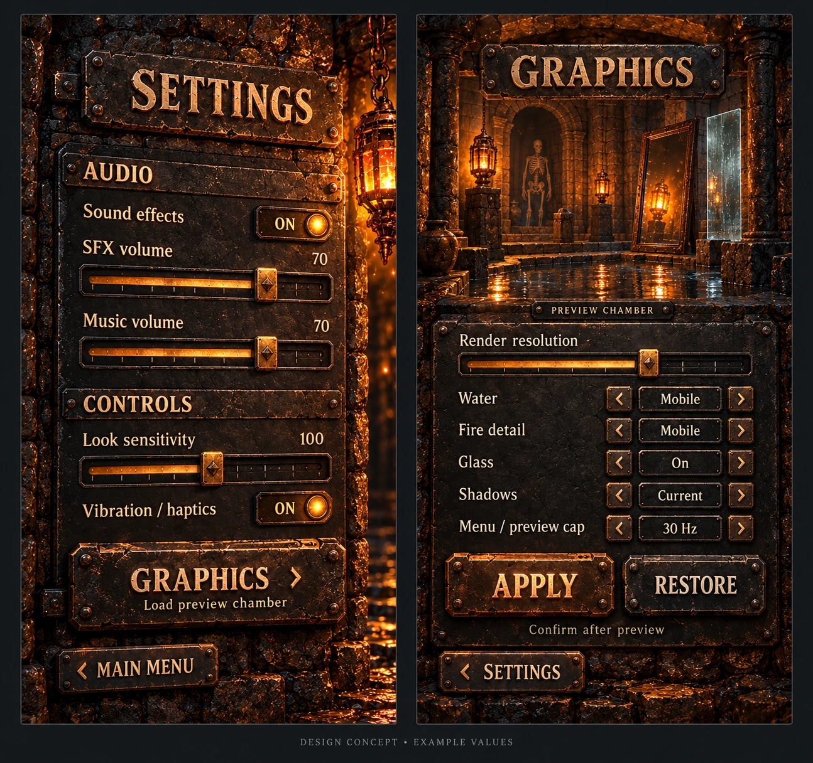
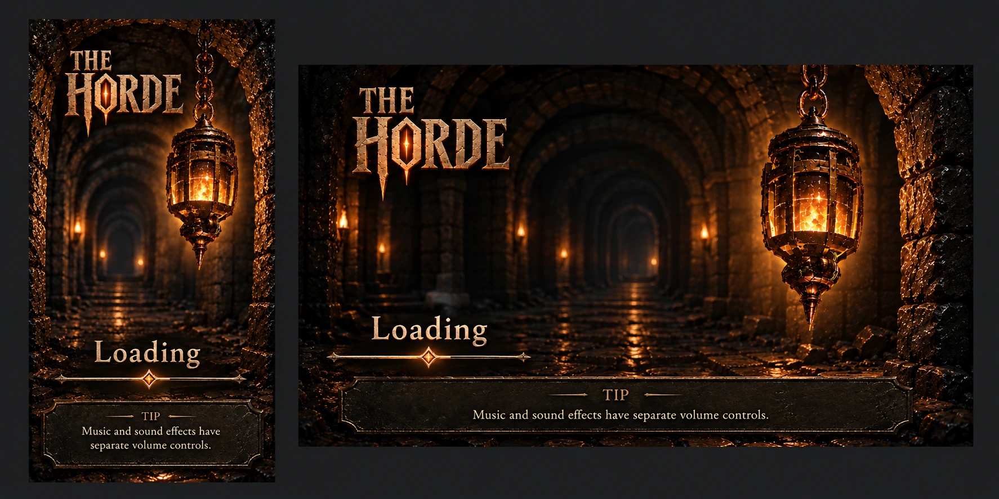

# UI and HUD reference archive

Reference art preserved 5 October 2026. These are generated design boards, not implemented UI, screenshots of a running build, pixel-perfect specifications or accessibility/performance evidence. The [1.7 plan](../../superpowers/plans/2026-09-11-beyond-the-tomb-1.7.0.md) owns implementation scope; preserve the accepted baseline and actual settings semantics.

## Selected direction

### Physical lantern main menu and HUD

The selected direction develops concept 3, **Carved Stone**, into a central hanging lantern with physical in-world buttons. Preserve real lantern flicker/sway. The future navigation direction is a camera pan left for Settings/More and a fade to black for Play/Continue, with reduced-motion support. HUD direction: three original heart icons and touch Swing, Parry and Dodge. Generated button positions/text are illustrative; actual touch hit targets, real labels, focus and gameplay semantics still need implementation and validation.

### Settings and Graphics

Keep working SFX, Music and Look sliders; Dialogue is a future capability, not a dead current control. Preserve the real Graphics controls and the Apply → Keep/Save flow with a 15-second rollback. The board is material/layout direction: its example values and switches do not add renderer capabilities or override the canonical settings contract.

### Loading composition, partially superseded

**Important: the painted loading bar is superseded. Use a SMALL SPINNER ONLY, not a progress bar.** Retain the reference for portrait/landscape composition, a deliberate crop and optional gentle pan, respecting reduced motion. It is archived unchanged in composition so the design history remains honest; the current instruction overrides the bar in the image.

## Earlier concepts and decision history

These are historical alternatives, not competing current implementation instructions.

- [Lantern Shrine](historical/horde-lantern-shrine-concept.webp): unselected exploration.
- [Lantern and Ash](historical/horde-lantern-and-ash-concept.webp): unselected exploration.
- [Carved Stone / central lantern](historical/horde-carved-stone-central-lantern.webp): selected starting direction, superseded in detail by the physical-button main menu above. Retained to explain the evolution.

## File custody

WebP review derivatives retain the original pixel dimensions; encoding is quality 92 with no crop or resize. Original PNGs remain in the owner's Library. [Reference manifest](../reference-manifest.json) records original filenames, SHA-256 and archived derivative hashes. The repository's existing PNG Git LFS policy is unchanged; these modest WebP documentation previews are ordinary Git blobs. No private download URL, account details or Library identifiers are published.

These are documentation references only. They are not automatically licensed runtime assets or covered by a blanket MIT asset grant. See [asset provenance](../../../ASSET_LICENSES.md).

## Earned loading verse — 7 October 2026

[The Tale Thus Far](../../TALE_THUS_FAR.md) develops the approved old-fable recap direction. A loading screen may show a self-contained couplet earned in the selected save, with the existing small-spinner-only rule. No progress bar, artificial loading delay, forced recital or unrevealed chapter titles. Fast loads can omit verse; a persistent optional reading view keeps it available. Exact layout and text are review drafts.
