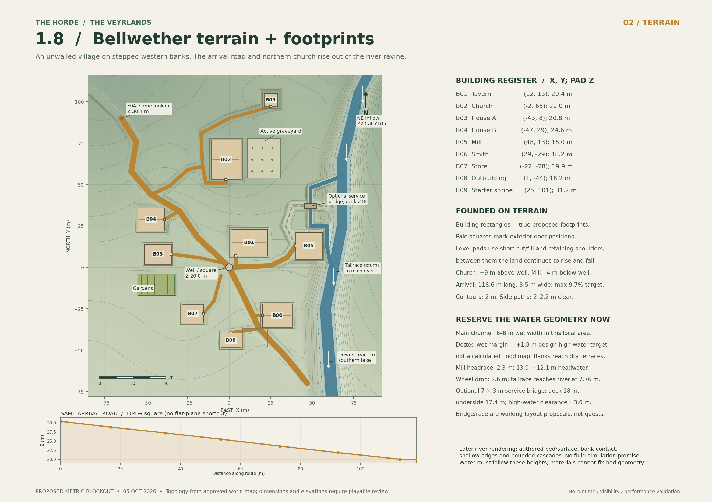
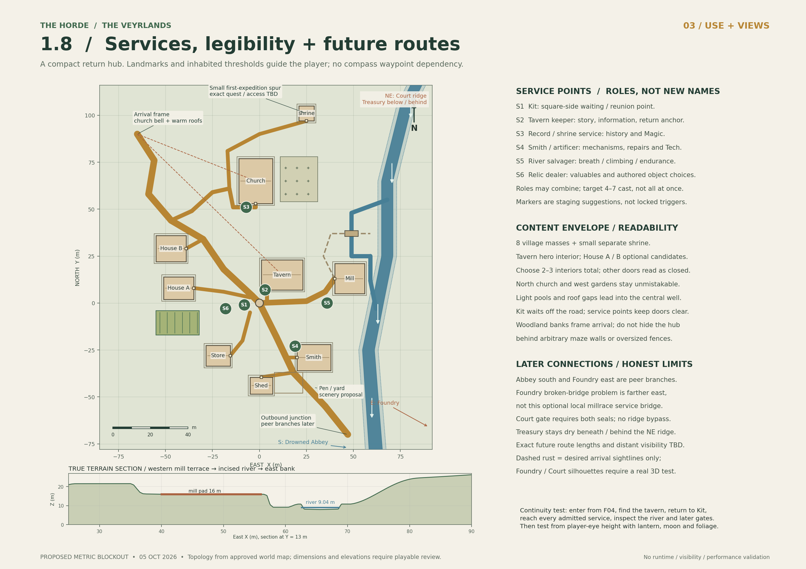
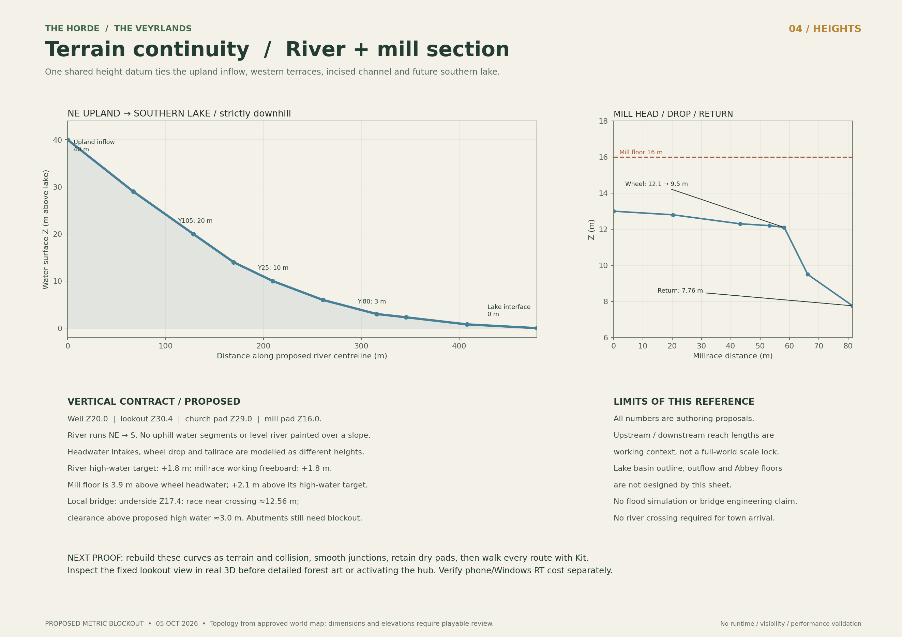

# Connected forest and Bellwether references

**Revision 2, 5 October 2026: coordinated blockout proposals.** Preserve the [approved regional topology](../../../WORLD_LAYOUT.md). These local drawings propose dimensions and heights; they do not certify collision, runtime navigation, exact tree/fence placements, sightlines or performance.

## Forest, 1.7

[Editable SVG](01-forest-track-1-7.svg) · [PDF](01-forest-track-1-7.pdf). Revision 2 updates the final town inset and tree/boundary labels, not the forest route or story anchors. This supersedes the initial delivered forest sheet.

## Bellwether, 1.8

[Three-page town PDF](02-bellwether-town-1-8.pdf) · editable SVGs: [terrain](02a-bellwether-terrain-1-8.svg), [use](02b-bellwether-use-1-8.svg), [water/height](02c-bellwether-water-height-1-8.svg).

## Editable data and boundaries

[Shared coordinates](shared-coordinate-layout.json) · [Building-feature register](building-feature-register.csv) · [Deterministic reference generator](build_maps.py). The generator is an optional planning tool, outside runtime; it needs NumPy, SciPy and Matplotlib and writes outputs next to itself. Run it in a separate writable copy to retain this frozen archive. The derived terrain array and bundled ZIP are not duplicated here.

- Tree circles are illustrative woodland massing, not exact approved instances. Hero/framing trees, natural banks/roots/rocks/undergrowth/fallen wood and selective off-trail pockets need playable review. Do not hide inviting gaps behind invisible collision.
- Garden dry-stone edges and timber pens are proposals. Keep Bellwether unwalled and preserve dry pedestrian openings.
- The optional mill service bridge is a proposed local detail, not the Foundry's broken-bridge access problem or a mandatory new quest.
- The 0.5 m terrain grid is planning geometry. A very short (~0.25 m) raster junction grade spike and up to 0.36 m mill route/pad blend still need production smoothing. Do not import it as final collision.
- Keep 1.7 ending at the lookout with a non-playable town shell. Later dungeons and their silhouettes remain separately scoped.

Map WebPs use lossless encoding at original dimensions. [Manifest](../../reference-manifest.json) records source and archive hashes. Original PNGs remain in the owner's Library. The original regional PNG is already stored separately and is not duplicated. See [provenance](../../../../ASSET_LICENSES.md).

## Detailed design notes and verification limits

THE HORDE / CONNECTED FOREST + BELLWETHER REFERENCE MAPS
Proposed metric blockout, 5 October 2026. Revision 2.

Read the forest first, then the town terrain and use sheets. The third town page supplies the river/mill vertical continuity proof. Revision 2's forest inset uses the final reviewed House B and mill positions; the forest trail, endpoint and story staging are unchanged from the first delivered forest sheet.

STATUS AND INTENT
The approved world reference establishes topology, not measured scale. These maps preserve it and propose one local coordinate system. Every dimension, height, building footprint, door, service position, route and water engineering detail is a blockout proposal. This archive contains planning references only. No runtime assets, Blender production, public release or gameplay implementation are included.

X = east; Y = north; Z = up. Units are metres. Plan origin = Bellwether well (0,0), Z20.0. Vertical datum = proposed future Abbey lake surface at Z0.0, not sea level. Coordinate conversion into engine axes must be chosen and tested once. The separate original tomb interior has not been surveyed or aligned to the proposed rescue rim: never reshape the accepted tomb blindly to match this map.

WHY THIS SIZE
Forest centreline length: 76.264 m, within the existing 40-80 m initial blockout envelope. A 2.4 m clear trail links 6.4 m reunion and 7 m lookout pockets. The route descends, dips and rises slightly before the lookout; maximum authored straight-segment grade is 7.27%. This is a short, atmospheric chapter with 2-3 bends, not added travel padding.
Lookout-to-well arrival: 118.645 m, 3.5 m clear, from Z30.4 to Z20.0. Maximum authored straight-segment grade is 9.63%, rounded to a 9.7% target. These are grade targets, not certified collider or accessibility results. No walking-speed or traversal-time claim is made.
Local side-path width: generally 2.0-2.2 m; mill working access 3 m. Main square has a compact gently graded apron around its level well centre, not an oversized flat platform.

FIXED GEOGRAPHY PRESERVED
Northwest old Keeper Tomb and rescue -> southeast forest -> lookout -> same northwest arrival into Bellwether. Town lies west of the descending river. Tavern/well are central; active church and graveyard north; gardens west; mill east; smith southeast. Starter shrine is a northern/northeastern spur. Abbey is south/downstream in a river-fed lake. Foundry lies east across the gorge. Court is on the northeast ridge; its dry treasury is below/behind that ridge. The Abbey and Foundry remain peer branches. Court still requires both seals. Future region arrows are directions, not measured dungeon entrances or verified sightlines.

FOREST STAGING
F01: separate later-created finale/rescue opening, fixed rope anchor, no replacement for any earlier grate/skylight.
F02: safe grounded reunion; player answers through a fresh visible lantern raise; Kit reacts after presentation.
F03: optional lantern/inscription pause. Exact clue remains authoring work, not an approved new puzzle.
F04: Kit waits; player retains control/backtracking; honest 1.7 endpoint with no enormous temporary wall. No new forest bridge, enemies or escort-failure system.
The same authored night continues through rescue, forest and town. The topographic sheet colours are diagram colours, not lighting direction.

TOWN ENVELOPE
Eight principal town building masses, plus one minor starter shrine. Hero tavern; House A/B are optional interior candidates. Choose 2-3 interiors total in later scoping; closed shells must look closed. Six service-role markers can be combined into the provisional 4-7 cast envelope; they do not imply simultaneous actors, new names, prices or quest scripts. Kit waits off the principal route. House B was moved clear of arrival. Church approach goes around its southwest corner to the actual southern door.
The register gives footprint sizes, proposed floor/pad heights and door coordinates. Small retaining shoulders/cut-fill sit under actual footprints. Graveyard and garden extents are shown separately. Sightline dashes are desired composition targets only; trees, roofs, ridge and real player camera must be tested in 3D.

WATER / TERRAIN
All terrain sheets and the mill section use one deterministic 0.5 m heightfield, with rolling landforms, road grading, terrace pads, carved river and a final reserved millrace cut. It is editable planning geometry, not a production collider or hydrological model.
The main water centreline is strictly descending from northeast upland context to the future lake interface. Its local wet width is approximately 6-8 m; a +1.8 m high-water target is reserved beside the channel. This is not a calculated flood boundary. Future basin containment, lake outflow, Abbey rooms and submerged access remain later design.
The optional western-bank millrace is 2.3 m wide: intake Z13.0, wheel headwater Z12.1, wheel tailwater Z9.5, final main-river return Z7.76. The race bends north/east of the mill footprint before the wheel; it does not run underneath the building. Mill floor Z16 is 2.1 m above the local wheel high-water target. The optional 7 x 3 m service bridge has deck Z18 and underside Z17.4, around 3.0 m clearance above the proposed high-water level at its crossing. Deck/abutment engineering remains blockout work. This local working bridge is not the Foundry's later broken-bridge access problem and introduces no mandatory new quest.
River rendering can later reuse suitable lake-water work, with authored descending surfaces, a real bed, shallow edges, rock contact and bounded cascades. Nothing here promises a full fluid simulation.

VALIDATION / REMAINING GATES
- Forest length and arrival length computed from the shared coordinate polylines.
- Main river and millrace water profiles checked strictly downhill; their final junction levels agree.
- Terrain is non-flat; contours, shaded terrain and mill cross-section all derive from the same saved grid.
- A second geometry audit caught and fixed church path/footprint intrusion and millrace burial/corner conflict.
- Up to 0.36 m of route/pad blending at the mill also needs production smoothing. One very short (~0.25 m) raster junction grade spike remains near the church/arrival junction despite continuous authored route-height targets. Smooth junctions when making production terrain. Do not import the planning grid as final collision.
- Final PDF pages were rendered and inspected along with PNGs and full-resolution label crops.
- No exact runtime visibility, collision, Kit navigation, water flood simulation, bridge engineering, RT cost or phone performance has been validated.

NEXT ACCEPTANCE TEST
Rebuild the proposed path/terrain curves at real scale, smooth road junctions, preserve dry pads and river clearances, align the rescue opening to the accepted tomb, and walk/backtrack every admitted route with Kit. Test the player-controlled lookout composition toward church/warm roofs, then 1.8 arrival-to-tavern before detailed art. Verify later-region silhouettes instead of assuming their visibility. Keep 1.7's shell non-playable and measure the combined forest/Kit/lantern/moon/fog/town RT workload on actual supported devices.

DELIVERABLES
01-forest-track-1-7: single-sheet lossless WebP review derivative, original PDF/SVG. Original PNG remains in the Library.
02-bellwether-town-1-8.pdf: terrain/footprints, services/routes, river/mill profiles.
02a/02b/02c: individual town lossless WebP review derivatives and original SVG sheets. Original PNGs remain in the Library.
shared-coordinate-layout.json: route, water, building, landmark and service coordinates.
building-feature-register.csv: measured proposed building register.
The larger proposed_terrain_heightfield.npz is omitted from Git to avoid duplicating derived binary data; the included generator reconstructs it. The supplied original bundle retains it.
build_maps.py: deterministic editable generator. Requires Python, NumPy, SciPy, Matplotlib. Run with a writable MPLCONFIGDIR. PDF/vector linework and labels are editable; shaded terrain is an embedded raster derived from the generated heightfield.

SOURCE AUTHORITY
Inspected both user-supplied map images, including the approved regional world concept and the earlier moonlit village perspective. The latter is visual inspiration; its illustrative bar is not a substitute for a measured terrain survey.
Canonical planning commit: 6aef4cde32188fd8a1ced2bef30360451f80aaae
https://github.com/Samfa12-tech/The-Horde-RT-demo/blob/6aef4cde32188fd8a1ced2bef30360451f80aaae/docs/WORLD_LAYOUT.md
https://github.com/Samfa12-tech/The-Horde-RT-demo/blob/6aef4cde32188fd8a1ced2bef30360451f80aaae/docs/CAMPAIGN_DESIGN.md
https://github.com/Samfa12-tech/The-Horde-RT-demo/blob/6aef4cde32188fd8a1ced2bef30360451f80aaae/docs/ASSET_PLAN_1_7.md
https://github.com/Samfa12-tech/The-Horde-RT-demo/blob/6aef4cde32188fd8a1ced2bef30360451f80aaae/docs/superpowers/plans/2026-09-11-beyond-the-tomb-1.7.0.md
https://github.com/Samfa12-tech/The-Horde-RT-demo/blob/6aef4cde32188fd8a1ced2bef30360451f80aaae/docs/superpowers/plans/2026-09-11-village-hub-1.8.0.md

PATH BOUNDARIES / TREE PLACEMENT
Tree circles are illustrative woodland massing, not locked tree instances. No tree symbols occupy the reserved clear trail or its reunion/lookout pockets. Later deliberate hero trees should frame town glimpses and occlude unfinished routes; fill density follows player-eye playtests and RT measurements. Use natural rising banks, roots, rocks, undergrowth and occasional fallen timber, with selective off-trail pockets. Do not fence the whole forest or substitute invisible walls. At the lookout reserve a safe standing area and a readable rock edge without blocking the future road. Town garden/old-boundary dry-stone walls and timber pen/work-yard fences are proposals; their openings must preserve the dry walking routes. Exact wall, fence and tree placements remain blockout work.

## Village-life design overlay — 7 October 2026

[Bellwether village life](../../../BELLWETHER_VILLAGE_LIFE.md) proposes small garden, livestock, service-yard and optional-comedy additions within this layout's reserved edges. It does not edit the archived coordinates, drawings or footprint register. Preserve the eight principal building masses, clear routes, water relationships and intended sightlines; exact minor-feature placement needs 3D review. Its bounded asset packages supplement this geometric reference without claiming runtime capacity.
