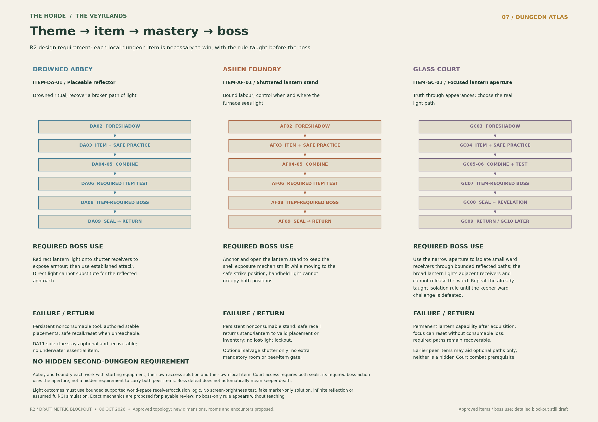

# Three-dungeon reference atlas — R2

**6 October 2026.** The owner approved the three theme/item/boss-use concepts. New metric geometry, 31 room plates, route lengths, elevations, encounter details and technical implementation remain **draft blockout proposals**. These are planning drawings, not validated level geometry, runtime assets or a gameplay acceptance certificate.

Read the [chapter plans](../../../DUNGEON_CHAPTER_PLANS.md), [campaign](../../../CAMPAIGN_DESIGN.md), [world layout](../../../WORLD_LAYOUT.md) and [Abbey delivery plan](../../../DROWNED_ABBEY_PLAN.md) together. Regional topology remains authoritative. The R2 source baseline was planning commit `48fd8d6e0ee73c480502906104593c4e6d3b8aae`; this archive accompanies its approved-item reconciliation rather than replacing canon with map detail.

## Sheets

| Sheet | Readable image | Editable drawing |
|---|---|---|
| Connected region | [WebP](01-connected-region.webp) | [SVG](01-connected-region.svg) |
| Approach plans and sections | [WebP](02-approach-plans-and-sections.webp) | [SVG](02-approach-plans-and-sections.svg) |
| Drowned Abbey floorplan | [WebP](03-drowned-abbey-floorplan.webp) | [SVG](03-drowned-abbey-floorplan.svg) |
| Ashen Foundry floorplan | [WebP](04-ashen-foundry-floorplan.webp) | [SVG](04-ashen-foundry-floorplan.svg) |
| Glass Court floorplan | [WebP](05-glass-court-floorplan.webp) | [SVG](05-glass-court-floorplan.svg) |
| Complications and transitions | [WebP](06-complications-and-transitions.webp) | [SVG](06-complications-and-transitions.svg) |
| Theme, item and boss progression | [WebP](07-theme-item-boss-progression.webp) | [SVG](07-theme-item-boss-progression.svg) |

## Editable source and measured-proposal status

- [Layout JSON](dungeon-layout.json), [room register](room-register.csv) and [route register](route-register.csv) retain stable IDs and dimensions. ITEM-DA-01 is the reflector, ITEM-AF-01 the shuttered stand and ITEM-GC-01 the focusing aperture.
- [Generator](build_atlas.py) and [baseline coordinates](baseline/shared-coordinate-layout.json) retain the drawing source. The baseline NPZ heightfield beside the JSON is draft terrain data, not a collision/render mesh. Rebuild in a working copy using Python 3, NumPy, SciPy and Matplotlib. Generated PNGs remain local working outputs unless admitted through the repository's LFS policy.
- [Validation](validation.json) records static coordinate, topology and item-gate checks: unchanged retained coordinates, unique room IDs, connected/non-overlapping room graphs, local-item reachability and no peer-item dependencies. It proves no player movement, collision, camera, enemy AI, water-volume, actual item use, loading or device performance.
- [Manifest](manifest.json) records original source hashes and archive hashes. WebP images are lossless derivatives with identical decoded RGBA pixels; SVG/data/source files are unchanged R2 bytes. No superseded R1 sheets are published here.
- [Asset planning register JSON](asset-register.json) and [primary register CSV](asset-register.csv) preserve 106 authoring packages, 48 map references, seven enemy/boss roles and 28 motion requirements. The JSON also includes item contracts, materials, sources, engine gates and budget trials. Quantities mix masters, sets, cue families and role configurations: never sum them as a total model count. Placement/instance counts are TBD blockout. These are authoring proposals, not simultaneous runtime instances, licences cleared or accepted device capacity. Ordinary role variants, timing, quantities and budgets are proposals; required item/boss-use concepts are approved. NPC/gear sidequests are omitted.

## Reading the plans safely

Abbey and Foundry remain playable in either order with their own access preparation, starting equipment and local item. Acquire each local tool early, practice safely, test it through rooms and actually use it at the boss. Court requires both peer seals and the aperture/ward challenge; defeating its keeper does not newly mandate death.

Green interior shortcuts unlock after the seal. The ordinary main route stays retreatable beforehand; forward puzzle gates must allow safe reverse passage. Checkpoints and streaming transitions are candidates, not a promise that a fixed traversal duration covers I/O. The established rope transition's no-normal-loading-screen contract stays intact; other loading compromises need measured review.

The Abbey is a river-fed lake, not an ocean. Its short submerged approach has recovery points; dry below-water rooms need coherent watertight boundaries and above-water air paths. Optional flooded rooms cannot hide indispensable items. The Foundry maintenance arch, Court switchback, approach complications and all section dimensions require playable blockout. Court's collapsed direct stair does not add a mandatory new climbing upgrade. The dry treasury remains beneath/behind the Court ridge and is outside these dungeon floorplans.

Existing Bellwether/forest metric coordinates are preserved as proposals, not upgraded to approved measurements. Main walking widths, route grades and distances are design starting points, not accessibility, input, traversal-time or stamina certification. NPC/gear quest proposals are not added as canon by this archive.

## Provenance and use

Owner-requested planning drawings and reference derivatives are preserved alongside the plans under the existing map-publication scope. This is documentation-reference custody, not a third-party licence assertion or blanket production-asset redistribution grant. Existing repository licence records remain unchanged. Each eventual runtime asset still needs its own rights/provenance audit. No new runtime art, engine code, gameplay testing, paid work or release is delivered.
