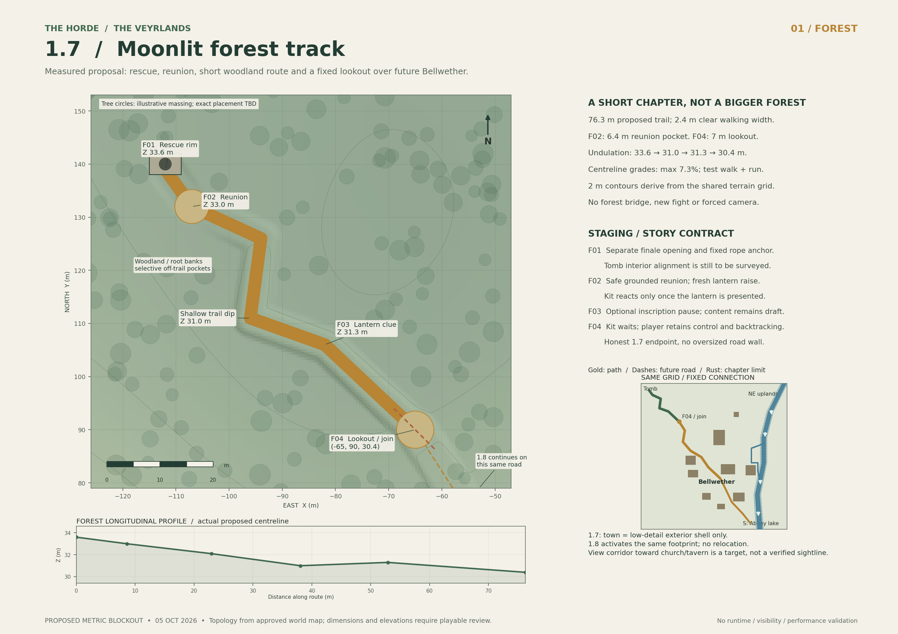
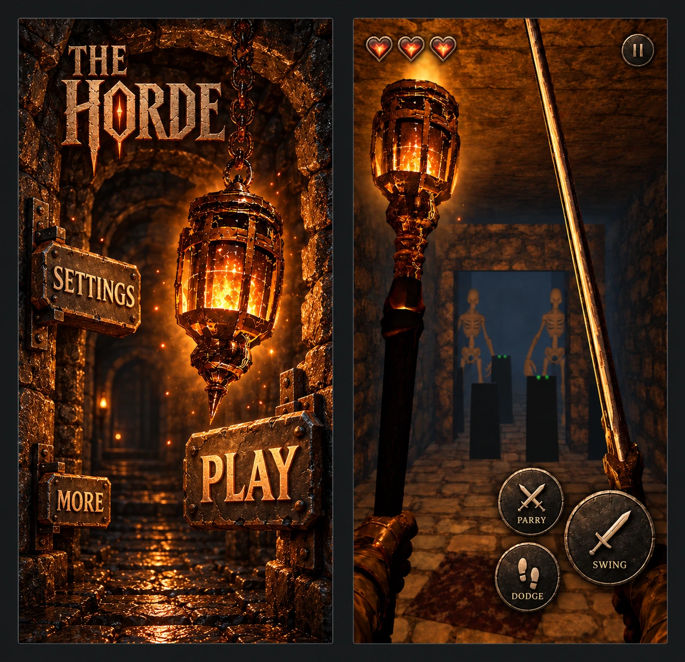

# Beyond the Tomb — 1.7.0 Scoped Update and Implementation Plan

> **For agentic workers:** Use `superpowers:subagent-driven-development` or `superpowers:executing-plans` when available. Execute one reviewed work package at a time. This is the complete master handoff, not permission to build every subsystem concurrently.

**Owner:** Sam Small / Samfa12  
**Prepared:** 11 September 2026  
**Executor:** Codex, with Astra medium selected by the owner  
**Goal:** Turn the existing dungeon into the game's prologue, then deliver a physical rope rescue into a beautiful, voiced, moonlit woodland chapter with a cohesive gothic touch HUD and menus.  
**Architecture:** Retain native Vulkan hardware RT and the shared fixed-step simulation. Add bounded world-zone ownership, genuine vertical traversal, one reusable companion actor, data-driven dialogue, outdoor atmospheric rendering, and a shared visual specification implemented through the existing platform UI layers.  
**Tech stack:** Existing C++/Vulkan/GLSL renderer, Android Java/JNI, Windows native platform layer, existing asset import/build tools; Blender for authoring and cleanup; Meshy for selected textured character assets; image generation for reference art and selected 2D assets.  
**Spec:** Sections 1–14 of this document are the scoped design specification. Sections 15–18 are the execution, verification and handoff contract.

**Status:** Planning only. The owner approved the preceding creative direction and requested this complete scoped handoff, adding Blender, image generation and an on-theme controls/menu refresh. No 1.7.0 runtime, artwork, voice recordings or performance evidence is delivered by this document. Numerical budgets below are proposed starting budgets, not measured capabilities.

**Start condition (updated 30 September 2026):** Follow the [canonical roadmap](../../ROADMAP.md): finish, accept, merge and release 1.6.1, then implement, validate and accept the 1.6.2 engine-readiness/demo-polish milestone before starting 1.7 gameplay expansion. Do not interrupt, merge, overwrite, re-version or declare complete the unfinished 1.6.1 engineering pass as part of this planning work. This documentation-only file may live on `main` before the implementation baseline is ready. Historical 1.6.1 inspection and feature-origin references remain context; re-audit the accepted 1.6.2 source and evidence as the actual 1.7 starting point. The full rope rescue, companion, forest and coherent moonlit outdoor programme remain in 1.7.

---

## Approved geography update — 3 October 2026

[WORLD_LAYOUT.md](../../WORLD_LAYOUT.md) now fixes the regional topology. The Keeper Tomb lies northwest in an abandoned burial ground beyond the woods; its forest path leads southeast to the **lookout**, which is the 1.7 chapter endpoint. Place a **low-detail distant village shell** below/beyond it in the fixed future 1.8 location. The land is The Veyrlands and this village is Bellwether (approved 3 October 2026). No playable village, interiors, NPC crowds or hub services enter 1.7. In 1.8 the same road continues into the village; do not create an enormous temporary wall across it or relocate the settlement later. The village's active churchyard is separate from the tomb burial ground. Exact distances and slopes remain playable-blockout decisions; this is bounded zone/area delivery, not a continuous open-world promise. Preserve all four separately approved dungeon-opening features and the later finale/rescue opening.

## Owner clarification — night and engine direction, 3 October 2026

The lich's defeat, lantern claim and tomb exit **must not trigger daytime in 1.7**. The opening, rope rescue, reunion and forest remain one authored night. Whether daylight ever enters the later game, and when or why, is undecided; neither a dawn reward nor a day/night cycle is promised.

The engine is the core product; The Horde is the game used to build and test it. Keep the dungeon useful as a compact showcase/regression workload while the adventure exercises real requirements. A shared engine with two application/content targets is a **packaging proposal**, not an approved module/repository architecture or instruction to split projects. See [the roadmap proposal](../../ROADMAP.md#engine-product-and-demo-game-packaging-proposal). No generic engine framework or large extraction is added to 1.7.

This direction changes the future campaign contract only. Preserve accepted 1.6.2 demo progression and frozen release artifacts unless a separately scoped change is approved.

## Owner clarification — Kit animation and rope staging, 4 October 2026

The [Kit animation acquisition and production plan](../../KIT_ANIMATION_PLAN_1_7.md) preserves the delivered shortlist, free alternatives, Blender workflow and separate player-motion appendix. Eric selects animations and handles rig/technical checks; Sam reviews the in-game appearance and feel. External clips and the Warden model remain candidates until rights, import, rig and scene validation pass. No generation or spending is authorised by this planning update.

The rope may deploy during lantern pickup, including offscreen, from a fixed world anchor while Kit idles nearby. No Kit throw, hand-release, recovery or rope-holding clip is required. Deployment is a one-time simulation event independent of Kit's animation; preserve lantern ownership, sufficient rescue-opening clearance and all existing climb/readiness gates. Visible arrival must remain credible if the player looks up, without camera coercion or view-dependent progression.

## 1. Source authority and what was actually inspected

The owner's latest instructions govern the new experience. Preserve `AGENTS.md` engineering/safety requirements and use the accepted 1.6.2 source as implementation authority. Historical documents remain evidence of their own versions, not proof of current implementation or performance.

Planning inspection used `codex/horde-1.6.1-engineering-pass` at `191d799ab7fda54fab36d9792b11f908ddaaf42d`. The branch's package note calls 1.6.1 an unpublished engineering candidate. This is an inspection snapshot, **not the mandatory future starting SHA**. Re-audit the accepted baseline before changing code.

Important inspected sources, relative to repository root:

| Source | Relevant finding / responsibility |
|---|---|
| `AGENTS.md` | Native RT, shared 60 Hz gameplay authority, coherent input mailbox, ordered feedback, Android/Windows validation and honest evidence rules. |
| `PROJECT_MEMORY.md` | Existing reward lantern, static GLB/PBR importer, player/character rendering, audio, RT Lab and historical finale. The rolling summary contains older details; inspect code before relying on counts. |
| `src/gameplay/simulation/SimulationSnapshot.h` | Player location is represented by `playerX` and `playerZ`; no general player-height component is present in this inspected snapshot. |
| `src/vulkan/raytracing/SimulationFrameAdapter.cpp` | Copies horizontal player location into render inputs and resolves roof/dawn overrides. Vertical traversal is an end-to-end dependency, not just a camera effect. |
| `src/vulkan/raytracing/PresentableTinyRtScene.h` | Historical `191d799` snapshot declares 16 BLAS and 20 TLAS instances. These are historical implementation bounds, not current capacity, permanent design limits or forest budgets; see the dated gap note below. |
| `src/gameplay/interactions/FinaleSequence.h` | Current sequence includes `DawnRevealed` and `Complete`. The new continuation must explicitly replace the campaign ending behavior. |
| `android/app/src/main/java/com/samfa12/hordelanternrt/MainActivity.java` | Native Android views, buttons, panels, settings, SoundPool/MediaPlayer and menu/ending/RT Lab state. Preserve platform behavior while extracting focused helpers. |
| `src/platform/windows/DiagnosticWindow.cpp` | Existing Windows gameplay/menu/audio/controller integration entry point; inspect the final baseline before changing it. |
| `docs/RT_WATERFALL_LICH_MIST_VALIDATION_2026-08-23.md` | Existing mist is an AABB-bounded, primary-depth-clipped, six-sample transmittance volume. This does not establish a complete outdoor, shadowed volumetric lighting system. |
| `docs/ENGINEERING_1_6_1_ANDROID_OBSERVATION_BASELINE_2026-09-05.md` | Exact Debug observation at 75%, internally 1080×2235, reported six checkpoint window-average medians of roughly 41–55 ms. These are not GPU timestamps, Release performance or a matched historical comparison. |
| `CMakePresets.json` | Existing Windows Debug/Release configure, build and test presets. |

The phone evidence above is a reason to measure the combined forest/lantern/companion workload early, not a reason to declare the final 1.6.1 slow or to prescribe an arbitrary low resolution. Do not compare those instrumented Debug observations directly with old cooled or differently configured runs.

The original brainstorming described unloading the dungeon during climbing and confidently mentioned Meshy custom motion. This specification tightens both: visible/RT-relevant geometry must remain resident, and custom-motion API availability is not a dependency. Verified rigging/preset animation plus Blender cleanup is the baseline asset route.

### Dated implementation gap note — 4 October 2026

Read-only source review of the paused 1.6.2 candidate `081f84a4661aade54142bf3fdc8d10d6e64bcf52` updates, but does not replace or accept, the historical snapshot above. The [scene ABI](https://github.com/Samfa12-tech/The-Horde-RT-demo/blob/081f84a4661aade54142bf3fdc8d10d6e64bcf52/src/vulkan/raytracing/RtSceneAbi.def#L1-L11) currently bounds instance metadata at 22, static assets at 10, primitives/materials at 32 each and texture layers at 16. These are implementation bounds, not device capacity or outdoor budgets.

The inspected [fixed LOD0 loads](https://github.com/Samfa12-tech/The-Horde-RT-demo/blob/081f84a4661aade54142bf3fdc8d10d6e64bcf52/src/vulkan/raytracing/PresentableTinyRtScene.cpp#L2150-L2206) and [filename-selected LOD budget validation](https://github.com/Samfa12-tech/The-Horde-RT-demo/blob/081f84a4661aade54142bf3fdc8d10d6e64bcf52/src/scene/assets/StaticMeshAsset.cpp#L1139-L1163) do not establish general runtime distance-LOD switching or regional streaming; neither was found in the reviewed path. The static GLB importer currently [requires OPAQUE alpha mode](https://github.com/Samfa12-tech/The-Horde-RT-demo/blob/081f84a4661aade54142bf3fdc8d10d6e64bcf52/src/scene/assets/StaticMeshAsset.cpp#L1183-L1187), so alpha-cutout foliage remains a capability gate. [TLAS policy](https://github.com/Samfa12-tech/The-Horde-RT-demo/blob/081f84a4661aade54142bf3fdc8d10d6e64bcf52/src/vulkan/raytracing/TlasInstanceRefresh.h) can require a rebuild for changed instance definitions; updates are not universally cheap refits.

Ray reach is already effect-specific: inspected [primary tracing](https://github.com/Samfa12-tech/The-Horde-RT-demo/blob/081f84a4661aade54142bf3fdc8d10d6e64bcf52/shaders/raytracing/include/rt_frame.glsl#L40-L43), [one bounce path](https://github.com/Samfa12-tech/The-Horde-RT-demo/blob/081f84a4661aade54142bf3fdc8d10d6e64bcf52/shaders/raytracing/include/rt_dielectric_common.glsl#L330-L336) and [moon/sky visibility](https://github.com/Samfa12-tech/The-Horde-RT-demo/blob/081f84a4661aade54142bf3fdc8d10d6e64bcf52/shaders/raytracing/include/rt_lighting.glsl#L1157-L1182) use different bounds. A long primary ray is not proof of correct distant reflection, shadow or light influence. Re-audit the accepted baseline and close these gaps through WP2/WP3 and §13.1; this note supplies no new device measurements and does not resume paused implementation.

## 2. Global constraints

- **RT or nothing:** keep actual native Vulkan hardware ray traversal and truthful `vkCmdTraceRaysKHR` swapchain presentation. No raster-only world, SSR, baked scene lighting or compute-only substitute.
- **Android first-class; Windows RTX equally validated.** Do not introduce an NVIDIA-only requirement. Reuse the final phone-safe recursion-depth-one/ray-query architecture.
- **Gameplay authority remains the shared 60 Hz simulation.** UI, rendering, audio backends and asynchronous loaders consume/publish contracts; they do not independently advance quests or traversal.
- **One frame in flight remains the default** until proper per-frame ownership is separately designed and measured. Do not break host-written TLAS instance safety.
- **Existing gameplay/feedback remains intact** outside explicitly changed prologue progression and the focused combat-timing corrections in Section 5.6. Preserve ordered input/feedback, damage/death semantics, delayed impact/fall cues, retry and pause cancellation; validate the intentionally revised contact/parry presentation rather than freezing the reviewed timing defects.
- **No broad engine replacement.** Build reusable components required by this chapter; do not introduce an ECS, editor, general open-world streamer or new rendering framework as a prerequisite.
- **Conventional 2D UI is allowed.** Native view drawing, text, scalable icons and compositing a menu are not a prohibited world-rendering fallback. Do not ray trace menu controls to prove compliance.
- **Blender is an offline production tool, not a runtime dependency.** Image generation provides art inputs, not proof of live engine rendering.
- **No untextured final assets or undocumented licenses.** Check source, permitted use, attribution, model/voice provenance and runtime import compatibility.
- **No new subscriptions, credit top-ups, actor hiring or unbounded paid generation without owner authorization.** Existing account access is not unlimited spending permission.
- **This task does not authorize publication.** Do not tag, sign, upload to itch/GitHub Releases, change public pages or claim release readiness without the existing release gates and explicit owner authorization.

## 3. Product scope and definition of the chapter

Working release label: **Showcase Alpha 1.7.0 — Beyond the Tomb**. This is a milestone subtitle, not a rename of Horde Lantern RT.

Deliver one complete extension: existing dungeon → Kit's early small-wall-panel call → two-guard encounter in the waterfall room → lantern reward → nighttime roof opening → companion's rope rescue → climb → woodland reunion → player-controlled lantern reveal → short companion-led forest trail → an authored atmospheric stopping point with continuing-story presentation.

Required content: one starting cave-in, a curated burial-purpose tomb-dressing layer, one coherent tomb/shaft/exterior entrance, one physical rope, one fully animated companion, one modest forest route, complete short-scene voice playback and subtitles, three-dimensional trees, mist/fog with real shadowed moon shafts, fireflies, forest ambience, and refreshed in-game controls/menus on both supported platforms.

Initial outdoor footprint: approximately **40–80 metres of authored trail**, with a clearing, two or three bends, a misty hollow and a lookout with an old waymarker as the final hook. Treat dimensions as blockout targets; choose final scale using player movement speed and scene composition. Do not stretch a small amount of content into a long empty walk. The player remains free to look and move within the corridor; this is not on-rails movement.

Explicitly outside 1.7.0: an open world, extra dungeons, a new forest boss, new enemy species, larger simultaneous combat groups, companion combat, escort failure, dialogue trees, inventory/economy, procedural quests, day/night simulation, advanced weather, full fluid simulation, hair/cloth simulation, multiplayer, fully simulated human climbing, or cinematic facial capture. Existing enemies remain the tutorial, with the bounded timing/contact foundation in Section 5.6.

Do not remove a required feature merely to finish quickly. When a required subsystem is blocked, record it honestly and continue independent work; final acceptance remains open. Optional density and ornamentation can scale before required features are cut.

**Story and voice authority (30 September 2026):** Read [CAMPAIGN_DESIGN.md](../../CAMPAIGN_DESIGN.md). The Horde retains the lost-army/treasure ambiguity; the lantern contains a deceptive entity claiming to be the dead king. Kit is the loyal companion and the player is silent. Preserve spoiler pacing: 1.7 hints at the mystery, not the late-game reveal.

## 4. Authored player experience

### 4.1 Opening cave-in

**Owner clarification, 3 October 2026:** In 1.7, start the player at the existing spawn facing the collapsed entrance. The initial camera orientation establishes the blocked retreat before the player turns toward the forward route. The same two skeletons' relocation into the waterfall room has since moved into the post-reset 1.6.2 scope (5 October; Section 4.1a), leaving the opening safe to take in. This does not bring the orientation change forward. Preserve immediate player control; no forced cinematic, automatic camera turn or input lock is required. This orientation change belongs to 1.7 only, not the active 1.6.2 runtime.

The collapsed entrance must read as a real cave-in, not a dressed-up flat wall. Use broken stone, dirt, a fractured arch and limited fallen timber consistent with the tomb. Show a blocked passage continuing beyond it where composition permits. Rubble must occupy real space, meet the floor and have a simple matching collision boundary. Keep the opening space and forward route clear.

Do not simulate the collapse live. It already happened. A few settling particles/stone sounds are optional; the geometry must communicate the event without them. A second exterior view of the blocked original doorway, visible from the upper clearing, can explain why the companion could not simply walk in.

### 4.1a Kit's early wall-panel call and the waterfall-room guards

**Latest owner clarification, 3 October 2026:** Kit first calls through the **small grated wall access panel just to the right outside the opening room** as the player safely approaches/passes. This early contact is independent of the later skeleton fight. It is not an entry-room skylight scene and not a voice from the waterfall hole or the separate large skylight in that room. Retain the wall panel and put the intended overgrowth from report **3696c1a2-5fb3-4476-aaeb-456a130837d8** there. Resolve the actual panel/voice anchor and approach zone from the authorised screenshot and accepted scene, not guessed coordinates or an assumed overhead shaft.

**Milestone correction, 5 October 2026:** Move the two existing skeletons from their current positions into the **waterfall room in the post-reset 1.6.2 pass**. In 1.7, retain and re-audit that accepted placement, early corridor draw and shared equipment foundation under [the 1.6.2 contract](../../IMPLEMENTATION_GOAL_1_6_2.md#shared-equipment-and-waterfall-encounter--owner-direction-5-october-2026), rather than rebuilding them. Keep two guards total, their keeper/lantern-guardian role and authoritative combat semantics, subject to Section 5.6's focused timing corrections; author safe placement, aggro/leash/reset and navigable combat space around the actual waterfall, without enlarging the encounter or adding enemies. Verify both are defeatable, cannot become stranded, and do not block the lich/reward route or create an unintended bypass.

The owner queued removal/closing of the **entry-room skylight**, retention/overgrowth of the **small wall panel**, and an impassable iron-bar grid over the **large waterfall-room skylight** as the final **1.6.2 visual slice after the current run and before release**. Leave the waterfall's own hole and its vines untouched, as the owner requested; this is a fourth, separate feature, not the skylight receiving bars. The grid casts strong readable real RT shadows and prevents the obvious early rope escape; neither retained grate opens for this contact.

**Rescue continuity:** Preserve the separate later-created reward/finale ruin/roof opening in Section 4.2 as the route that enables Kit's rope rescue. Kit does not know about the lich. Do not write the early call or later rescue as Kit knowingly waiting for the boss fight; scene geometry and the later opening provide the opportunity. No early lantern ownership, rescue access or prison lore is implied.

Kit is unseen beyond the small wall grate. Anchor a fixed world-space voice source just beyond that panel at its actual authored position, using the shared directional SFX/listener infrastructure with a separate Dialogue gain bus. No camera grab, forced interaction or player reply. The call acknowledges the collapse, reassures the player that treasure is ahead and warns them to be careful; it reveals no lantern/prison lore or knowledge of the lich. Script and trigger contract: Sections 7.3–7.4.

The retained wall-panel overgrowth and queued final skylight changes are 1.6.2 environment polish, governed by [the 1.6.2 goal](../../IMPLEMENTATION_GOAL_1_6_2.md#final-visual-slice--after-the-current-run-before-162-release). Skeleton relocation and shared draw/sheath/early-draw behavior are now queued post-reset 1.6.2 work. The voiced introduction, Kit trigger and dialogue/subtitle controls still belong to 1.7 after its start gate; the paused 1.6.2 run is not resumed by this plan.

### 4.1b Burial-purpose tomb dressing and restrained decay

**Owner-approved 1.7 addition, 4 October 2026:** Give the tomb a coherent burial purpose before layering on age and neglect. Prioritise real wall recesses containing skulls/bones, then add a small supporting funerary/decay kit. This is content work after the accepted 1.6.2 start gate, not a change to the active 1.6.2 run, a rebuild of every wall or a new dungeon. The [tomb asset breakdown](../../ASSET_PLAN_1_7.md#tomb-burial-and-decay-kit-a17) owns sourcing and bounded authoring.

**Visual hierarchy and placement**
- **Burial niches first:** Use selected modular wall bays with genuine shallow recesses, stone lintels/shelves and readable skull/bone arrangements. Mix intact occupied niches with empty, disturbed and broken examples. Recess depth, silhouette and lantern-cast shadows must come from real geometry; a dark rectangle or normal map on an unbroken wall is not a niche. Preserve believable wall thickness and adjoining rooms, without opening accidental sightlines or passages.
- **Funerary traces:** Add occasional displaced sarcophagus lids, urn fragments, offering bowls and spent candle stubs near appropriate burials. Group related objects so they tell a small burial/disturbance story; avoid evenly scattered generic clutter. These are static dressing, not new loot, physics props or interactable puzzles.
- **Selective cobwebs:** Favour unused niches, high corners and sheltered gaps. A few torn webs can suggest passage through otherwise neglected space; do not blanket active walkways, guards or important silhouettes. Sparse web geometry or supported cutout material is an experiment to validate, not a promise of a cheap transparency path.
- **Structural decay:** Put fallen mortar and small stone chips below visibly damaged masonry, with rare larger fallen blocks/boulders only where the wall or collapse can explain them. Keep their scale and material related to the source damage. Do not turn every corridor into a rubble obstacle course.
- **Moisture and identity:** Place tide/mineral stains along plausible water paths and historic waterlines; use moss only where moisture and available light make sense. Worn Keeper crests, burial seals and offerings become selectively more elaborate toward the Lich, giving the route a quiet ceremonial hierarchy without revealing the lantern twist. Decorative burial seals are not new collectible treasury seals or progression keys.

**Production and rendering:** Inspect Horde and suitable Briarhold candidates for fit, rights and importability before reuse; no existing niche, skull, urn or cobweb asset is assumed to be available. Blender is the default for modular recesses/lintels, simple funerary props and clean rubble/bone derivatives where suitable source geometry exists, or small authored replacements where it does not. Reuse shared stone/metal/bone surfaces and a compact atlas for fine motifs/weathering where useful. Fine erosion, stains and worn carving can use normal/roughness/material detail, but geometry owns cavities, projecting edges and important silhouettes. The asset plan governs optional verified Poly Haven inputs and original crest/decal concepts; this approval starts no generation, spending or asset transfer.

**Traversal, RT and mobile limits:** Keep the walking line, low-passage clearance, waterfall combat space, attack sightlines, wall-panel contact, chest and rescue approaches clear. Small debris and webs must not create unseen collider traps; large solid props need simple collision matching their visible extent. Never use an opaque backing sheet to fake a web or a collider to block its apparently open gaps. Start with a few reused meshes/materials and bounded placements, then measure 3D LODs, unique BLAS/TLAS work, texture/mip residency and affected ray visibility. Preserve primary, shadow and supported reflected/transmitted views; frustum-only hiding must not erase relevant shadows/reflections. Web cutout/any-hit or transparency traversal, repeated ray hits, screen coverage and pixel/overlap cost require an isolated and combined phone test before increasing density. No new generic decal, destruction, physics or rendering engine is a prerequisite.

**Sound:** Use restrained, locally plausible drips, occasional settling grit and stone creaks through the existing spatial ambience/event system. Reuse/audition licensed clips first; maintain the accepted stone-footstep balance and Section 5.5's real grounded-contact cadence, with grit variation only where appropriate. Bound variation, rate and voices; preserve pause/mute behavior and keep skeleton movement, attack/parry cues and Kit intelligible. Do not imply a live collapse or add an independent audio engine.

**Acceptance:** Review the complete tomb route in motion on Android and Windows, with torch/lantern low and raised, confirming burial purpose reads before clutter and the approach to the Lich becomes more ceremonial without visual noise. Check genuine recess depth, grounded props, water/light-consistent weathering, stable small detail at supported render scales and coherent RT secondary views. Walk/run/turn/fight and backtrack through dressed areas with both guards, low-clearance sword handling, chest and rescue flow intact; no snagging, hidden blockers, escape gaps or obscured combat cues. Record matched dressing-on/off frame-time/resource evidence, including the worst web view and the combined chapter workload, before accepting density. Audition drips/creaks/steps beside combat/dialogue on phone and Windows. Source renders and this document do not establish runtime, performance or owner art/audio acceptance.

### 4.2 Reward and night opening

Preserve the accepted Lich/chest sequence, including the separate two-second chest unlock if it remains the accepted 1.6.2 behavior, the guidance cue and actual claim interaction. The player must own the lantern before rescue progression can complete.

For the 1.7 campaign, replace the returning-dawn/ending-card transition with a moonlit opening. Lich defeat, lantern acquisition, roof opening, rescue completion and zone entry must never advance the environment to daylight. Decouple geometric opening/progression from time-of-day lighting: keep the later-created rescue aperture and reward ordering without carrying forward the demo's dawn effect. Use the same moon orientation, exposure policy and sky inside and outside. Opening stonework must have a believable place to move; do not lift an enormous roof through trees, terrain or the companion. Rework the lid/oculus and upper chamber geometry only as necessary for a traversable shaft.

On opening, the player sees actual sky, rim stone, roots/branches and the companion above. Preserve the ability to look around. Use a short objective and positional voice to draw attention instead of forcing a long camera turn.

### 4.3 Rescue and rope

**Locked owner direction, 5 October 2026:** Use the rope ascent and return descent as hidden-loading transitions in 1.7, with no loading screen on the normal route. This is approved planning, not implemented streaming or measured device capability; it adds nothing to current 1.6.2 work. Defeating the Keeper moves the Keeper's gravestone out of the way of the separate finale/rescue exit. Preserve the lantern-claim and safe-opening gates below. The displaced stone stays visibly in its new position when the player pulls up onto the forest path; it cannot vanish or reset on backtracking. Fit its movement, collision, shaft and landing to the accepted tomb and the connected map's F01 rescue point. Exact gravestone dimensions, travel and final placement remain real-scale blockout work; the reference drawings are not a survey.

The rope deploys once during lantern pickup when the reward and rescue-opening gates permit, while Kit can idle safely nearby. Offscreen deployment is acceptable; a visible throw, hand-release, recovery or holding action is not required. The rope pays out from a bounded authored starting arrangement, then falls and reacts dynamically to gravity, the rim and shaft. Its upper end has a visible, credible fixed tie-off on a tree, stone ring or tomb fixture. The rope's arrival remains credible if the player looks up; neither the camera direction nor Kit's hand animation gates progression.

The interact prompt becomes `Climb` only once the rope is deployed, reachable, anchored and the traversal destination is ready. Interaction must use the existing semantic action, not a new bespoke platform control.

### 4.4 Climb and summit

A single action begins a reliable short ascent, initially targeting about **4–7 seconds of traversal playback**, depending on the final shaft. This is an authored animation target, not a fixed I/O deadline or guarantee that loading finishes in that time. Prepare early and gate readiness before committing to the climb; never stretch it into an endless animation or stall at the rim. No repeated tapping, stamina meter, quick-time event or fall-death challenge.

**Reuse the accepted 1.6.2 shared equipment mechanism; stow both sword and lantern before gripping the rope, leaving both hands free.** Add the traversal-specific attachment/physics integration here, not a parallel equipment state machine. Author safe, visible carry attachments on the actual player rig; hip/back placement is a prototype choice, not a locked socket specification. Check stable placement and clearance against body, rope and stone in both directions. Equipment stays owned with no drop, deletion, duplicate or replacement award. The lantern remains physically present and lit: its emitter moves with the stowed lantern and retains coherent illumination, glass, reflections and shadows, with no phantom hand-position light. After releasing and reaching a safe grounded landing, restore the prior valid held-item configuration. The first reunion still restores the lantern lowered and requires a fresh raise under §4.5.

Climbing changes the authoritative player/world position. Hands contact the simulated rope via grip targets; shoulder/elbow motion, body/shadow and held-item transforms follow the same traversal state. Author actual rope grips, upward travel and the pull-up/mantle against the real shaft height and rim. The camera follows a stable climbing frame, not every high-frequency rope oscillation. Allow modest, bounded look movement and use the real shaft/stone geometry to occlude retired content; no forced fly-through or camera tour to hide unloading. Define and test the permitted view envelope before relying on occlusion. Provide reduced traversal motion with minimal bob/roll without disabling the rope simulation.

The summit reveals an overgrown tomb emerging from a wooded bank, not a square dungeon box on a flat plane. Roots over masonry, soil buildup, fallen stones, wet leaves and a clear trail establish place. The displaced Keeper gravestone reads clearly beside the rescue opening. The view back down remains coherent wherever the player can see it.

**Return trip:** Interact at the same exterior rope to climb down. Begin preparing the tomb on approach, admit descent only when its landing and required resources are ready, and author descent, hand changes, rim entry and the lower landing separately rather than blindly reversing the ascent clip. Stow both items for two free hands and restore them only when grounded. Retain Keeper defeat, claimed loot, displaced gravestone, dialogue/reunion flags and checkpoints across repeated trips. Kit waits safely in a bounded exterior position if not accompanying the player; this does not add a tomb-companion or Kit-climbing mechanic.

### 4.5 Reunion and lantern lesson

The companion approaches a safe conversation position, asks about the lantern and looks between player and lantern. The player raises it using the existing Raise/Lower action. Do not substitute an automatic cinematic for this interaction.

If the lantern was raised before climbing, stowing and restoring it leaves it lowered for this lesson. Consume a **new raise action during the reunion**, not a stale input edge from before the climb. The player may look away, pause or take time; the story cannot soft-lock. One delayed reminder is allowed, not constant repeated dialogue.

The warm lantern lights the companion, nearby bark and appropriate fog against cold moonlight. The silent player's gesture and Kit's reaction follow the raise event; there is no voiced player answer. This is the chapter's central lighting/character moment.

### 4.6 Woodland continuation and stopping point

After the exchange, the companion turns onto the trail and walks ahead, waiting when the player lags. Give the clearing a brief quiet interval before new instructions. Let the player admire the scene, raise/lower the lantern and inspect the tomb.

Bends reveal compositions rather than identical tree corridors. Use banks, roots, rocks, fallen trees and understory as natural boundaries. The forest continues visually beyond them; no distant-flat-image substitute for the nearby woodland.

At the final lookout/waymarker, reveal the approved distant low-detail village shell and let the companion wait. This is the fixed future hub location; a restrained sound or silhouette may support the quiet hook without implying an extra playable area. The chapter ends in-world with a continuing objective and an optional themed `Continue exploring / Return to menu` panel opened by the player. Do not automatically cover the forest reveal with the old completion overlay. Do not imply a further playable level already exists.

## 5. World zones, continuity and vertical movement

### 5.1 Choose residency from evidence, not from a cinematic assumption

The approved normal rope route has **no loading screen in either direction**. Choose the simplest measured residency policy that fulfils it at the early [six-gate readiness review](#131-six-gate-outdoor-readiness-contract). Seamless presentation does not require both full zones or every detail level to remain resident:

| Candidate | Use / trade-off |
|---|---|
| Preload the modest forest and keep both zones resident | Simplest continuity. Accept only if measured peak memory, RT work and warm performance are satisfactory. No requirement to stream for its own sake. |
| Stage a shared transition region and incrementally prepare the forest | Preferred expansion path when residency needs managing. More synchronization and rollback work, but reusable for later chapters. |
| Explicit loading/recovery screen | Failure/emergency recovery only, with truthful retry or return to a safe place. It is not the normal rope transition. If measured constraints block the approved experience, report the blocker for owner review rather than silently changing the contract. |

The rope climb is a useful preparation interval, **not permission to destroy a visible dungeon**. The player can look down; reflections, transmission, moon/lantern shadows and indirect paths can still depend on off-camera geometry. Frustum culling alone is not a valid RT residency policy.

Represent the world as `Dungeon`, `TombTransition` and `Forest` logical zones with stable IDs and clear ownership. Keep a shared `TombTransition` containing the relevant upper dungeon room, shaft, rope, rim, gravestone and immediate clearing resident across either direction. Retire remote dungeon resources only after they cannot contribute to permitted view/light paths; retain the upper-room geometry while the opening can be inspected. After the first occluding trail bend, unload additional content only with hysteresis and a tested backtrack policy. No visible pop-out, disappearing shadow or fake painted view down the shaft.

Begin forest preparation during the reward/rope-approach sequence, not only after the player grips the rope. On return, begin tomb preparation on the exterior approach. Readiness includes required assets, collision, textures, uploads, BLAS/TLAS publication and pipeline warm-up; consume it through the authoritative simulation before enabling/committing the interaction. A slow prepare keeps the player in a safe controllable place with truthful status and retry/cancel behavior, never a frozen or endlessly climbing player. Snapshot logical state before retiring the source zone: boss victory, claimed loot/lantern, moved gravestone/other persistent placements, dialogue and checkpoints survive resource unload.

A small 1.7.0 forest may reasonably remain entirely resident once entered. Measure peak overlap, CPU/GPU memory, texture residency, BLAS/TLAS build/update cost, upload/staging peaks, pipeline warm-up and transition frame pacing on the actual phone and Windows targets before setting numeric budgets. Neither both full zones resident nor a timed climb masking arbitrary disk speed is a requirement. Do not build a general streaming open world.

### 5.2 Ownership and threading

Persistent campaign/player state belongs above zone resource lifetimes. Zone descriptors own authored placement, collision references, asset requests and scene membership; the renderer owns GPU residency/builds and exposes readiness/failure. Shared simulation consumes readiness at fixed-step boundaries.

Read/decode on worker threads only when useful and thread-safe. Submit/upload/build/publish through explicit existing ownership, with bounded upload work, transfer/RT barriers and GPU completion tracking. Never free buffers, descriptors, images, BLAS or TLAS still referenced by submitted work. Changing geometry/instance counts may require a rebuild rather than an update; follow Vulkan's exact rules [R5].

Use generation IDs to reject stale load completion after restart, save restore, retry or Android lifecycle reconstruction. Keep a last safe zone and checkpoint until destination publication succeeds. Failure leaves the player safe with a truthful retry/back-to-menu option; it must not strand them in the shaft.

### 5.3 Vertical position and ground support

Add coherent 3D transforms/height through simulation snapshots, renderer adapter, shader camera origin, collision, body/hand sockets, lantern pendulum inputs and audio listener/source positions. Do not add a height offset only inside the shader or only on one platform. Check ray distance/bounds and world-space environmental calculations outside the original corridor.

Keep the existing dungeon collision path working. For the forest use a bounded walkable surface/height representation with simple collision volumes and limited slopes/steps. Handle the climb and mantle as explicit traversal modes; a general rigid-body character controller is not a prerequisite.

Define a consistent metres/up-axis/forward-axis convention and use Blender export conversion once. Test orientation rather than assuming the tools and runtime use identical axes.

### 5.4 Finale and UI integration

Separate `prologue reward completed`, `rescue available`, `forest entered` and `chapter endpoint reached`. Do not reuse one `finaleComplete` boolean for all of them. Enumerations exposed through JNI, captured state or saved data require deliberate migration, not ordinal renumbering.

Campaign play uses the night continuation. Treat roof/opening progress, reward ownership, rescue progress and environment state as separate contracts. Audit simulation state, frame adapters, shader dawn/aperture controls, mist/exposure and platform ending surfaces together; renaming a phase or hiding the ending card alone is insufficient. Historical roof/dawn RT Lab controls may remain clearly labelled diagnostic/legacy controls, isolated from campaign progression. Retain RT Lab unlock access after the reward, preferably through pause; repeated finale polling must never replace the lab or a dialogue/menu surface. Update old ending/retry/checkpoint contracts explicitly while preserving historical evidence.

### 5.5 Larger-world walking, running and surface-aware footsteps

**Owner direction, 3 October 2026:** Revisit traversal pace for the larger world in 1.7: the present walking pace may become frustrating, so evaluate a run toggle and material-aware footstep sounds. This is future 1.7 planning after its start gate, not an addition to the frozen/current 1.6.2 implementation. The proposed controls and tuning below require blockout and usability acceptance; no stamina, exhaustion or progression gate is implied.

**Read-only source check:** At [main snapshot `1df058b7`](https://github.com/Samfa12-tech/The-Horde-RT-demo/commit/1df058b77baacaab76dc112f578deb77ddb791e9), [`GameSimulationConfig`](https://github.com/Samfa12-tech/The-Horde-RT-demo/blob/1df058b77baacaab76dc112f578deb77ddb791e9/src/gameplay/simulation/GameSimulation.h) defaults to 1.9 m/s; [`UpdateMovement`](https://github.com/Samfa12-tech/The-Horde-RT-demo/blob/1df058b77baacaab76dc112f578deb77ddb791e9/src/gameplay/simulation/GameSimulation.cpp) normalizes diagonal input and resolves collision before driving `TravelFootstepCadence` from actual distance. [`InputSnapshot`](https://github.com/Samfa12-tech/The-Horde-RT-demo/blob/1df058b77baacaab76dc112f578deb77ddb791e9/src/gameplay/simulation/InputSnapshot.h) has no run command/state; [`SpatialAudio.h`](https://github.com/Samfa12-tech/The-Horde-RT-demo/blob/1df058b77baacaab76dc112f578deb77ddb791e9/src/gameplay/SpatialAudio.h) already supplies distance cadence, pan, rolloff and route obstruction. The audio inventory already includes two player and two skeleton step variants, and the shared bounded gameplay-event queue already carries footstep events. These observations do not prove current platform playback, a live speed measurement or the final accepted 1.6.2 source; re-audit that baseline before implementation. Extend those paths rather than adding another input, cadence or audio engine.

**Run-control proposal:** Preserve precise walking and analog movement, with an explicit mobile Run toggle that fits the accepted touch layout and clearly shows its state. Desktop uses a held run binding by default plus a hold/toggle accessibility choice; settle bindings against existing controls and document them in Controls/help. Publish run intent through the existing coherent input/mailbox and fixed-step movement authority, with normalized diagonal speed. Store the control preference separately from transient running state. Clear transient run intent on pause/menu, focus loss, touch cancellation, death/retry/load and traversal-mode changes so resuming never produces a stuck run. Rope/climb/mantle use their own explicit speeds; run must not multiply dodge distance, combat timing or scripted traversal. Define and test attack/parry-to-run transitions rather than silently changing encounter balance.

**Tune with the world:** Compare walking and candidate running times through the actual 40–80 m forest blockout and the approved map's local routes. Keep the regional layout fixed while testing local distances, turns, stopping and sightlines; do not invent a universal run multiplier or enlarge empty corridors to compensate. Preserve careful lantern/clue interaction and Kit's intelligible trail dialogue, waiting and catch-up behavior if the player runs ahead or lags behind. Check collision and stopping clearance at both speeds, including narrow tomb openings, slopes, steps/stairs, water edges, relocated guards and rope approaches. Body/held-item animation, stride/contact timing, torch/lantern retraction and light/socket motion must remain coherent; no forced camera bob or FOV kick is required. Record route times, subjective comfort and exact-device frame-time/resource evidence before locking speed.

**Surface/contact contract:** Extend authoritative ground support with a small, extensible authored surface classification at the actual supporting contact, independent of render-texture filenames or color guesses. Initial candidates are stone, dirt, grass/leaf litter, wood and shallow water; activate only surfaces genuinely present in the accepted chapter/blockout. Wood is not a commitment to add a bridge, and a wet-looking stone texture is not shallow water. Resolve overlapping ground/water regions and boundary priority explicitly, provide a safe default for untagged ground, and prevent boundary jitter from replaying contacts. Reuse actual post-collision travel and grounded contact/stride state for walk/run steps. Do not emit ordinary ground steps while stationary, pushing into a wall, airborne, climbing, teleporting or restoring a checkpoint. Any landing cue must come from a real grounded transition, with a bounded intensity and no simultaneous duplicate step; this does not introduce a jump mechanic.

**Sound and water reuse:** Author a few licensed, normalized variants per admitted surface, avoiding immediate repetition with restrained pitch/gain variation and coherent walk/run cadence. Preserve the accepted quieter player-footstep balance and independent SFX gain/mute; retain separate Music and Dialogue control and avoid masking speech/combat cues. Use existing bounded playback voices/event ownership and spatial attenuation for world actors, with sensible listener-local player steps and mono-phone review. Cap concurrent voices, event rate and per-surface assets; no unbounded overlap, per-frame loading or catch-up burst after resume. Share a single authoritative wet-contact event with [Section 6.1](#61-proposed-17-exploration-player-reactive-vines-and-water): it selects the wet step/splash sound and optional admitted ripple/droplet response once, rather than starting separate splash and footstep loops. Waterfall body-contact spray remains separately rate-limited; it must not duplicate a wet-foot contact or retrigger the one-shot torch failure.

**Acceptance:** Add deterministic tests for walk/run input edges, hold/toggle cancellation and restore, diagonal speed, collision-resolved distance, grounded and traversal transitions, surface fallback/priority/boundaries, one-shot landing/wet-contact ownership and queue/pool exhaustion. On Android and Windows, review run + look + combat together, precision interactions, steps/slopes/doorways, Kit dialogue timing, material changes, stationary/wall contact, repeated water crossing and pause/resume. Confirm no stuck inputs, clipping regressions, skating, audio spam or duplicate water cues, and record audible SFX-zero/Dialogue-zero behavior and bounded cost. Source review alone is not completion or evidence of better traversal feel.

### 5.6 Combat timing, readable contact and parry feedback

**Owner-approved 1.7 addition, 4 October 2026:** Include a focused animation/timing/hit-detection pass following the owner's report that parry timing feels poorly aligned with the attack animation. Keep the existing shared 60 Hz simulation, immutable snapshots, coherent input publication and ordered semantic feedback. This is gated 1.7 work after acceptance of 1.6.2; it does not reopen PR18, change frozen demo artifacts or authorise a general combat/physics-engine replacement.

**Source-reviewed starting evidence:** The read-only review used [PR18 candidate `abcfd862f4de21a07206d65a6c7055ecda4a6054`](https://github.com/Samfa12-tech/The-Horde-RT-demo/blob/abcfd862f4de21a07206d65a6c7055ecda4a6054/src/gameplay/SwordCombat.h), not a new runtime test. Re-audit the accepted 1.6.2 baseline before implementation.

- Skeleton damage/parry resolves once when windup crosses 1.12 seconds. The renderer samples normal attack phases continuously but separately names 1.20 seconds as contact and starts stagger there. This proves conflicting contact conventions; it does **not** prove an 80 ms error against actual visible contact. Scrub the authored clip at real combat distances before selecting the shared marker. [Gameplay resolution](https://github.com/Samfa12-tech/The-Horde-RT-demo/blob/abcfd862f4de21a07206d65a6c7055ecda4a6054/src/gameplay/SwordCombat.h#L618-L651); [clip mapping](https://github.com/Samfa12-tech/The-Horde-RT-demo/blob/abcfd862f4de21a07206d65a6c7055ecda4a6054/src/vulkan/raytracing/CharacterRenderSlot.cpp#L22-L105).
- Successful parry sets a 120 ms reaction but clears the whole player combat snapshot on the next fixed update. Its visible recovery/jolt can therefore disappear inside a multi-tick render frame, despite a valid success event. Preserve immediate riposte availability while fixing that presentation lifetime. [Next-tick reset](https://github.com/Samfa12-tech/The-Horde-RT-demo/blob/abcfd862f4de21a07206d65a6c7055ecda4a6054/src/gameplay/SwordCombat.h#L234-L268); [success state](https://github.com/Samfa12-tech/The-Horde-RT-demo/blob/abcfd862f4de21a07206d65a6c7055ecda4a6054/src/gameplay/SwordCombat.h#L628-L638).
- Player hits use a nearest-target horizontal range/cone check on entry to Active, while the visible downstroke travels for the next 160 ms. They do not follow a moving blade or continuous contact volume. [Hit timing](https://github.com/Samfa12-tech/The-Horde-RT-demo/blob/abcfd862f4de21a07206d65a6c7055ecda4a6054/src/gameplay/SwordCombat.h#L329-L387); [blade travel](https://github.com/Samfa12-tech/The-Horde-RT-demo/blob/abcfd862f4de21a07206d65a6c7055ecda4a6054/src/gameplay/items/HeldItemKinematics.cpp#L284-L337).
- Commands retain monotonic counts but no individual press timestamps; one latest input snapshot is applied across catch-up ticks. Enemy pose refresh is throttled by clip/time without an explicit contact/phase key. These are timing/presentation risks to measure, not proof of a particular device latency. [Input contract](https://github.com/Samfa12-tech/The-Horde-RT-demo/blob/abcfd862f4de21a07206d65a6c7055ecda4a6054/src/gameplay/simulation/InputSnapshot.h#L10-L38); [catch-up delivery](https://github.com/Samfa12-tech/The-Horde-RT-demo/blob/abcfd862f4de21a07206d65a6c7055ecda4a6054/src/gameplay/simulation/GameSimulation.cpp#L65-L122); [pose refresh](https://github.com/Samfa12-tech/The-Horde-RT-demo/blob/abcfd862f4de21a07206d65a6c7055ecda4a6054/src/vulkan/raytracing/CharacterRenderSlot.cpp#L211-L219).

**Required bounded foundation**

1. Add a development-only trace/overlay joining input-edge time, consumed simulation tick, attack identity/phase, intended contact, sampled pose, damage/parry result and presented frame. Record exact build, platform, backend and settings; do not diagnose feel from final-state snapshots alone.
2. Define one shared attack timeline for phase durations, clip mapping, contact marker/window, facing commitment and cancel/recovery rules. Gameplay and rendering consume it; dispatch crossed markers once per attack instance within fixed-step intervals, never from render callbacks or exact floating-point equality. Calibrate readable contact before widening the parry window.
3. Retain individual timestamped attack/parry edges through the existing coherent transport and map them to simulation ticks under an explicit catch-up/late-input policy. Preserve ordered, deduplicated commands and lifecycle cancellation. Specify simultaneous attack/parry priority and whether a short recovery buffer is admitted; neither automatic parry nor an unbounded command backlog is implied.
4. Make successful recovery immediately cancelable into an ordinary riposte, while allowing guard/recoil feedback to decay when no action follows. Keep feedback lifetime separate from action availability, blend cancellation cleanly, and force fresh poses at meaningful contact/reaction transitions without requiring every idle pose to refresh at 60 Hz.

**Conditional contact refinement:** First calibrate and test the existing bounded range/cone model against the visible action. If that cannot provide reliable spatial contact, admit a small simulation-owned capsule/segment or authored attack-volume sweep across the active interval, with per-attack target deduplication, explicit range/facing and wall/occlusion rules, and measured platform cost. Use appropriate hand/weapon proxies for the actual assets. GPU-rendered triangles, GPU readback, full rigid-body combat, a general physics engine and new root-motion locomotion are not prerequisites. Do not silently enlarge the two-guard encounter, change Keeper parryability or add new enemy species/combat mechanics.

**Acceptance:** Replay the same timestamped physical input trace at 15/30/60/120 FPS, jittered delivery and 50/100/250 ms stalls with an explicit dropped-time policy. Test both sides of every startup/contact/recovery boundary; success on an early versus final catch-up tick; feedback persistence and immediate riposte; coalesced/duplicate/simultaneous inputs; unavailable actions; targets entering/leaving range or moving across the strike; side/rear and wall cases; and pause/resume, focus loss, death/retry/load. Preserve single-hit ownership, both skeleton IDs, combo behavior and separately scoped Keeper damage/lockout. Validate actual Android/Windows motion and press-to-visible-contact feel, audio/haptics and bounded cost on the exact candidate. Separate deterministic test success from owner feel acceptance and untested-device gaps.

### 5.7 Alternating hand motion and low-clearance sword handling

**Owner direction, 4 October 2026:** In 1.7, give the hands a slight alternating phase offset rather than having both bob in lockstep. Also lower the sword through low sections, with a subtle upper-body duck only if needed: the owner reports that the torch already handles this clearance while the sword clips. These are owner observations to reproduce on the accepted baseline, not a verified root cause or an instruction to change the active 1.6.2/PR18 runtime.

**Motion and equipment contract:** Use restrained, smoothly blended left/right offsets for natural idle and walking motion, and tune the transition into running against Section 5.5. Retain the existing equipment sockets, hand grips and IK constraints. Item-specific grips and active attack/parry/traversal poses take priority over decorative sway; do not add an offset that moves the hand away from its weapon, changes contact timing or erases successful-parry feedback. Coordinate with Section 5.6's shared combat timeline and preserve immediate riposte. Respect reduced-motion settings; hand alternation does not require stronger camera bob, roll or a forced FOV effect.

**Clearance contract:** Reproduce low passages with the actual sword, torch and accepted player pose, then inspect and reuse the working torch-clearance path where appropriate. Base a bounded sword-lowering/retraction pose on measured world/ceiling clearance and the held weapon's swept extent, with smooth entry/exit and stable behavior near thresholds. A small upper-body duck may supplement this only when needed and comfortable; do not silently move the gameplay camera or introduce a crouch mechanic. Keep authoritative player collision, traversability, weapon reach, attack/parry outcomes and light/socket ownership coherent. Lowering a presentation pose must not grant access through an impassable gap or let attacks pass through geometry. Define safe blends for attack/parry, item changes, walk/run, turns, stopping, rope entry and recovery; avoid snapping or repeatedly pumping the pose at a low ceiling.

Use the shared solved player/equipment pose for the visible hands and the corresponding world representation. Preserve the established primary/viewmodel ownership and complete world-body RT shadows, reflections and transmission without duplicate limbs/weapons, missing secondary geometry or a camera-only clipping workaround.

**Acceptance:** Capture real Android/Windows motion at idle, walk and run, entering/leaving low passages, turning or looking up/down under ceilings, and stopping at clearance boundaries. Include torch/sword/lantern transitions, attack/parry/riposte near low geometry, rope entry/exit, pause/resume and death/retry/load. Check first-person, relevant external/inspection views, RT shadows and reflected/transmitted views for natural alternation, stable grips/IK, no weapon/ceiling clipping, unchanged collision/gameplay and reduced-motion comfort. Test pose priority, threshold stability, interrupted blends and single pose ownership, and record bounded CPU/AS/frame-time cost. Screenshots and source inspection alone do not establish motion quality or owner comfort acceptance.

## 6. Physical rope and traversal contract

Use a bounded XPBD-style rope solver within the fixed-step simulation [R4]. Initial implementation settings: one rope, up to 32 nodes, fixed upper anchor, distance constraints, modest bending resistance, gravity, damping, two substeps per 60 Hz tick and a small fixed iteration budget. Treat these as starting values; measure stability and cost before locking them.

Model the deployment starting configuration and any bounded deployment impulse independently of Kit's animation; do not keyframe every rope node along a prerecorded sway. Use segment/capsule-style collision against simplified shaft/rim/ground proxies, with substeps or swept contact sufficient to prevent tunnelling. Full knots, rope cutting and arbitrary rope self-collision are outside scope. Choose a loose starting fold/deployment that does not require a knot solver.

Use a single continuous deformed tube mesh with stable topology and tangent frames, driven by node state. Prefer one refittable BLAS; compare a bounded segment-instance alternative only if it proves better on the actual hardware. Keep UV density/diameter stable, and avoid geometry seams, exploding frame rotation, per-frame allocations and rebuilding the entire forest because the rope moved. Refit legality and synchronization must be tested, not assumed [R5].

During climbing, progression is controlled by the traversal mode, with bounded grip/load constraints feeding the rope. This is a **dynamic rope coupled to authored traversal**, not a full dynamic human. The visible rope must take load, change tension and respond to release. Do not drive it with a cosmetic sine wave while calling it physics.

Required checks: deterministic repeatability on the same build, finite state after repeated deployment, bounded stretch under the configured load, no rim penetration, correct anchor, stable camera, no catch-up explosion after pause, reachable interact region while swinging, and multiple interactions consumed once. Initial visual target: settled segment stretch within 3% and no visible shaft clipping; document any tuned tolerance.

Pause freezes progression and the rope. Restart cancels the sequence and pending loads. Mid-traversal application termination restores the last safe pre-traversal checkpoint on the correct side, with coherent orientation, gear and persistent progress; successful summit restore does not replay the reward or duplicate ownership. Once climbing starts, ordinary locomotion/attack/parry/dodge commands are consumed rather than buffered. Pause/back remains available; no accidental jump/fall command is introduced.

### 6.1 Proposed 1.7 exploration: player-reactive vines and water

**Owner idea, 3 October 2026:** Explore hanging vines that move when the player walks through them, reusing the planned rope foundation, and contact splashes both in puddles/shallow water and while walking through the waterfall. These are scoped 1.7 investigations after its start gate, not additional 1.6.2 work or a promise that every effect will ship. Full fluid simulation remains outside 1.7.

**Inspected baseline:** The 1.6.2 candidate at [dfd5a8f1](https://github.com/Samfa12-tech/The-Horde-RT-demo/commit/dfd5a8f1b405a4a07a97629d69fcace9280d8dcc) has static geometry-backed hanging growth, three separated falling-water streams in a dedicated BLAS, and catchment/runnel water in static world geometry. [Scene construction](https://github.com/Samfa12-tech/The-Horde-RT-demo/blob/dfd5a8f1b405a4a07a97629d69fcace9280d8dcc/src/vulkan/raytracing/PresentableTinyRtScene.cpp) and [water shading](https://github.com/Samfa12-tech/The-Horde-RT-demo/blob/dfd5a8f1b405a4a07a97629d69fcace9280d8dcc/shaders/raytracing/include/rt_dielectric_common.glsl) provide real ray-traced surfaces and bounded optical transport, not a fluid solver. The [existing drench trigger](https://github.com/Samfa12-tech/The-Horde-RT-demo/blob/dfd5a8f1b405a4a07a97629d69fcace9280d8dcc/src/gameplay/ShowcaseGameplay.h) is a one-shot torch-failure event; it is not an existing repeatable splash system. Re-audit the accepted baseline before implementation.

- **Vines:** First prove one or a few reachable strands using the Section 6 fixed-step rope solver with a fixed upper attachment, vine-specific bending stiffness/damping and simple player-capsule plus local wall contacts. Reuse constraints, collision and mesh-update infrastructure rather than rescue/climbing state. Keep leaves attached coherently and preserve their real RT silhouettes. These are pass-through reactive dressing, not new climbing, entanglement or player-blocking mechanics. Measure an explicit strand/node/contact budget before expanding density; do not simulate every decorative vine.
- **Stage A, shallow water:** Add authoritative repeatable water-contact events at actual wet-foot contact, driven by movement/footstep cadence and surface membership. Emit a bounded pool of world-space ripple disturbances and positional splash audio, scaled modestly by contact speed. Clip disturbances to the catchment/runnel or authored puddle boundary; wet stone alone must not spawn water effects. Stop step splashes while stationary. A surface-normal ripple on real ray-hit water is a valid modest first pass, but it does not displace the water silhouette and must not be described as simulated fluid geometry.
- **Stage B, droplets and waterfall contact:** Add a small fixed-capacity, short-lived pool of world-space RT-visible droplets at shallow-water steps and player/body intersection with the actual falling streams. Use simple gravity, bounded collision and lifetime rather than particle-particle fluid forces. At the waterfall, add a brief entry burst, rate-limited local contact spray while actually intersecting the flow, and impact ripples below; standing under falling water can continue limited spray even when footstep splashes stop. Use the stream's actual transformed shape, including any RT Lab width change, rather than the broad legacy trigger rectangle. Keep the original one-shot gutter/drop timing and ownership intact; repeated water contact must never retrigger or duplicate it.
- **Separate advanced investigation:** Water physically parting around the body, coherent sheets/foam, displaced volume and flow reacting to arbitrary geometry are substantially larger simulation and rendering work. Do not smuggle this into the local splash prototype or assume the rope solver solves fluid dynamics. Any stream deformation would also require reconciling its rendered geometry with the analytic exit-surface/refraction logic.

**RT and cost gate:** Preserve genuine native hardware ray traversal on supported backends, current material/visibility rules and bounded reflection/refraction paths. No screen-space splash overlay presented as world-space RT and no raster-only fallback. Reusing an immutable droplet mesh with bounded TLAS instances is one candidate; a fixed-topology refittable mesh is another. Compare actual instance count, traversal, BLAS/TLAS update cost, synchronization, memory and shader cost on phone and Windows. Deformed vine geometry requires legal synchronized BLAS updates/refits; transform-only instances still cost TLAS work. Keep pools, emission rate, lifetimes and update iterations fixed-bounded, with no per-frame allocation or whole-scene rebuild. Repeated transparent droplets must not accidentally introduce recursive/unbounded water transport. Do not promise all reflections in Mobile, whose existing water path deliberately omits the reflected-scene query.

**Acceptance before promotion to required scope:** Compare effects on/off at matched camera, quality, render scale and thermal context, including water crossing near both relocated guards. Verify repeated crossings, entering/leaving/stopping, pause/resume/restart, pool exhaustion, no dry-floor splashes, no double torch failure, stable vine anchors/no explosive stretch, local wall/player contact, and consistent direct/reflected/transmitted views where supported. Record actual CPU/GPU/resource costs and owner motion/audio review. Reduce optional density or retain the simpler proven stage if the combined chapter budget does not support the next stage; no measured performance or completion claim is made by this plan.

## 7. Companion, animation and dialogue

### 7.1 One reusable actor, not a new enemy exception

Add one friendly actor with a stable entity identity. Reuse existing skinned-asset/animation/render-slot infrastructure, but do not overwrite a skeleton or Lich slot without explicit lifetime ownership. Avoid widening combat enemy limits as a side effect. The forest requires only the player and one companion to be animated characters.

Default visual brief: an original practical adult human dungeon crawler, travel-worn layered clothing, restrained gothic detail, belt equipment, readable hands/face and a short coat or garment that skins well. No ornate full-body armor, long simulated cloak or complex hair. Final face, presentation and colors should be selected from a small reference set; use **Kit** as the companion's narrative/speaker name; a stable generic internal entity ID may remain.

**Briarhold reuse candidate, 3 October 2026:** Assess the existing Warden at `assets/meshy/runtime/briarhold-warden-1k.glb` before producing a replacement Kit. Asset review used a SHA-matched deployed GLB and Blender renders: the mask fully covers nose and mouth; recorded inventory is 25,968 triangles, a 24-joint skin, seven clips (idle, walk, run, jump, fall, slide, mantle), approximately 6.71 MiB and one material with four 1K textures. These are candidate asset facts, not proof of Horde importer compatibility or phone performance. The provenance record names Samfa as owner; generation entitlement/distribution rights still need verification before transfer/shipping. Validate scale, rig/clip semantics, native RT import, memory and skinning cost; preserve source/runtime provenance. An identity tweak and authored speaking/lantern-reaction gestures may be needed. The concealed mouth does not require visible lip-sync; subtle head/body acting can carry speech. No asset transfer, generation or implementation is delivered by this note, and this candidate is not yet a locked final Kit design.

Required animation behaviors: idle/breathing, approach, restrained listening/concerned talk, lantern reaction, turn, walk, wait and natural bounded look-at. A look-down pose is conditional on the final staging. Reuse compatible clips and author only necessary transitions/adjustments in Blender; verify blend-layer/IK support before relying on it. No throw, hand-release, recovery or rope-holding clip is needed for Kit. A one-time runtime deployment event owns the anchored rope independently of body animation. See the [animation plan](../../KIT_ANIMATION_PLAN_1_7.md) for candidate IDs, acquisition gates and acceptance checks.

Walking follows an authored collision-aware route with stopping points and speed matched to stride. No advanced navmesh/companion combat system is required. Wait before disappearing around a bend when the player lags. Never visibly teleport through the player, trees or tomb; prevent blocking the only route. Look-at is bounded and blended, without head spins. Idle continues during conversation unless paused.

### 7.2 Voice deliverable

Ship actual offline voice audio for the mandatory exchange, with one consistent Kit voice. The player is silent: do not produce player dialogue clips. Owner recordings, a licensed synthetic voice or authorized actors are acceptable. Do not clone or imitate an identifiable real person without authorization. Select/verify any provider and commercial distribution terms before paid generation; no provider, subscription or specific model is assumed by this plan.

**Voice direction, 3 October 2026:** The owner imagines an English accent with a medieval-fantasy feel; no exact regional dialect is selected. Treat this as a modern performance direction, not a claim of a historically authentic universal medieval accent. A light northern English/Yorkshire-inspired delivery with warmth, practicality and dry humour is a provisional audition option; a softer southern English option can provide a comparison. Keep regional colouring subtle and words intelligible, especially through the grate. Final casting/accent requires listening and owner choice. This planning addition authorises no voice generation or spending.

Store lossless source recordings outside runtime packaging; produce normalized, trimmed mono runtime clips through the accepted audio pipeline. Record provider/performer permission, voice identifier, generation/recording date, source hash and derivative processing. No API keys, private account data or signed temporary download URLs in Git. Gameplay must run offline, with no live TTS or network request on an interaction.

Subtitles and temporary voice are valid development scaffolding, but **subtitles-only is not completion** of the scoped voiced scene.

### 7.3 Initial script and triggers

**Whole-story authoring, 3 October 2026:** [CAMPAIGN_DIALOGUE_BANK.md](../../CAMPAIGN_DIALOGUE_BANK.md#4-opening-tomb-rescue-and-forest-17-focus) preserves these stable IDs and proposes tighter rescue/reunion wording plus sparse forest beats. Review those refinements before replacing the provisional defaults below; neither version is approved recording copy. The bank's later hub/dungeon/finale scenes do not expand 1.7, and first lantern speech is proposed for the later hub chapter. The silent raise event and trigger/infrastructure contracts here remain authoritative.

These are provisional implementation script defaults, updated for the owner-approved silent protagonist. Kit provides conversational momentum without speaking the player's thoughts; leave room for quiet and player agency. Keep line IDs stable when the owner edits wording. Direction labels are not spoken.

| Line ID | Speaker / delivery | Text | Trigger |
|---|---|---|---|
| `prologue.kit_grate` | Kit, concerned call through the small wall access grate; unseen | Mate, are you ok? I heard the collapse! The treasure should be just ahead. Be careful! | First safe eligible wall-panel approach, independent of the later waterfall fight, before reward/rescue; see contract below. |
| `rescue.found` | Companion, relief calling down | There you are! I thought that cave-in had buried you. | Roof sufficiently open; actor in position. |
| `rescue.rope` | Companion, practical | Hold on. Rope coming down. | After first line; anchored deployment ready during lantern pickup. Runtime event owns deployment, not a hand marker or audio completion. |
| `reunion.question` | Companion, eager but believable | Did you find it? Tell me you found it. | Player safely at summit and companion at reunion mark. |
| `reunion.hint` | Companion, gentle reminder | Let me see. Raise it. | Once only, after a generous idle delay during the raise lesson. |
| `reunion.answer` | Silent player action/event; no audio or subtitle line | — | Fresh valid raise action; wait for visibly presented lantern. |
| `reunion.proof` | Kit, wonder | Then we're not chasing a story anymore. | After silent raise event; lantern visibly presented. |
| `reunion.first_piece` | Kit, thoughtful | A start, then. Let's see where it leads. | After wonder reaction; provisional wording, no claim to know the prison's nature. |
| `reunion.depart` | Companion, quiet purpose | Good. Let's find the rest. | Exchange complete; begin trail-leading state. |

The `prologue.kit_grate` text preserves the owner's proposed line with light punctuation/capitalisation cleanup. It is a **draft, not approved final recording copy**; keep its ID stable when wording changes. The later `rescue.found` wording is also provisional: author it as renewed contact after this earlier call, not a contradictory first introduction.

**Grate trigger and overlap contract**
- Trigger once on the first safe eligible approach through the small wall-panel zone. Do not require clearing the relocated waterfall skeleton encounter; eligibility comes from the early route/contact state and current safety. No look-at requirement, stopping requirement or mandatory acknowledgement; allow the player to walk past. Use authoritative encounter/player state, not audio completion, to establish eligibility.
- If combat or a higher-priority story line is active, defer while the player remains in a sensible audible approach area. Cancel stale pending delivery once they leave that area or enter the later rescue; a missed call must not play remotely or block progression. A later eligible return before rescue can trigger an unheard call.
- If combat resumes during playback, suspend/end the introduction safely without suppressing critical combat cues, locking input or looping the line. Do not automatically restart from the beginning on every re-entry. Track pending, started and consumed state; completion, explicit skip or combat interruption consumes the one-shot for the run. Normal pause/resume continues through generation-safe dialogue handling.
- Persist the consumed flag with applicable checkpoint progress; restoring that progress must not replay the call. A deliberate fresh run resets it. Missing audio uses subtitle/fallback timing and cannot gate the lich, reward, roof or rope. Starting a save beyond this early contact must not retroactively inject the call.
- Verify first approach, early approach during combat, pass-by, backtrack, distance boundary, overlap, skip, pause/resume, checkpoint restore and stale callbacks. Preserve the silent player and later rescue/reunion semantics.

The hint is conditional, not an extra line forced into every playthrough. Do not require camera aim at the NPC for quest progress. The answer event is nonverbal; do not trigger Kit's response before the lantern has reached its presented pose. The story context can use a short objective such as `The Horde — follow your companion`; do not add a lore monologue.

### 7.4 Dialogue infrastructure

Use a small line manifest: stable line ID, speaker/entity, subtitle, audio asset, gesture, start condition, once-per-run/checkpoint policy and skip/completion behavior. A dialogue controller sequences state; platform backends play audio and report completion with a generation/line token. Stale completion messages must be ignored after pause/reset/reload or a skip. Audio duration/metadata provides a bounded fallback when playback fails, so missing audio cannot lock the game.

Subtitles default on, with an explicit persisted on/off option, speaker label, configurable size and opaque-enough scrim. On mobile, place them near the top within the safe area, clear of cutouts, vitality/objective/pause HUD and touch controls; adapt wrapping and reserved HUD space at large font scales rather than overlaying essential information. Retain legibility on bright sky and dark stone. Companion speech is world-positioned with distance/pan and appropriate interior-to-exterior treatment; the player has no speech channel or spoken lines. Future lantern-entity voice positioning is a separate scoped design decision. Retain intelligibility, and do not bake tomb reverb permanently into a clip also heard outside. Use subtle animation/head/jaw response if the rig supports it, but cinematic phoneme-perfect facial animation is not required.

Provide an independent persisted **Dialogue** volume slider, separate from **Music** and **SFX/Ambience**, as specified in Section 10. Dialogue zero must not mute other buses or disable enabled subtitles. Reuse shared spatial sound infrastructure rather than creating another audio engine. For the wall-panel call, test a fixed source beyond the actual grate while turning, approaching and walking away: bounded distance attenuation, stone/grate occlusion and existing ambience must preserve intelligibility. Do not anchor the source overhead merely because an earlier draft called it a skylight. Preserve comprehension through subtitles with speaker/location context (for example, `Kit, beyond the grate`) when stereo direction/elevation is unavailable, including mono phone output. Do not require hearing spatial cues to progress or claim universal elevation localisation on phone speakers.

Dialogue can pause/resume with gameplay. Provide an explicit skip for the current spoken line; skip is not the gameplay Interact action and must not skip the player-controlled raise lesson. Missing optional audio falls back to subtitle timing and a diagnostic. Story events are exactly-once state transitions, never dependent on the player hearing the clip.

## 8. Forest graphics, sky, mist and fireflies

### 8.1 Composition and assets

Four modestly varied tree archetypes plus a few rocks, ferns, roots and ruin modules should create the first woodland. Use real 3D trunks, branches and canopy volume with instancing/LODs. Hero trees frame the tomb and moon. Reuse materials and geometry; variation comes from approved scale/rotation, clustering and layout, not hundreds of unique downloads.

Nearby trees cannot be billboard replacements. Farther scenery may use simpler **3D** silhouettes/LODs with truthful limitations. Do not silently replace the requested forest with a skybox forest image. Benchmark actual triangle, instance, material, texture and acceleration-structure costs. Camera-visible triangle count alone does not describe RT cost.

Opaque leaf geometry versus alpha-masked leaf clusters is a measured choice, not dogma. If alpha masking is used, implement/test consistent cutout visibility for primary, shadow and secondary rays. Avoid relying on a desktop-only micromap extension. Do not substitute transparency blending and call it equivalent. Keep mobile-critical alpha-tested overlap low.

Wind is gentle deformation of selected foliage/branches. Its RT geometry/bounds and shadows must agree. Use shared pose/deformation buckets or another bounded method when beneficial; do not refit every detailed tree independently by default. No camera-space waving texture pretending to cast physically moving branches.

### 8.2 Night environment

Use one night environment definition for the dungeon opening, transition and forest: visible sky/miss environment, moon disk/direction, moon illumination and exposure. Sample the same environment for relevant reflected/transmitted paths. Separate image appearance from calibrated illumination when importing an LDR sky image; it does not become a physically calibrated HDR environment by relabelling it.

The moon must be an actual direct-light source, using a shared directional emitter (with a finite angular disk where the chosen quality model supports it), aligned to the visible moon's world direction and angular extent. Calibrated radiance and real hardware-RT visibility/transmittance through roofs, the iron grid, trunks, foliage and characters determine illumination; define the outdoor shadow-ray reach from scene extent/residency rather than inheriting a short room-sized range. Use the same source for relevant surfaces, secondary paths and participating mist. A brighter moon painted into an LDR sky texture is not evidence of scene illumination, shadows or GI. Keep sky/environment radiance accounting explicit so the visible disk and sampled emitter do not double-count its energy.

Image generation may supply a seamless sky reference or texture only after projection/seam/color checks. An analytic sky with restrained stars and moon is a valid starting implementation. Volumetric clouds, astronomy and time-of-day progression are not required. Do not paint one moon into the sky and light from a different direction.

The forest must read as night, not daylight with a blue filter. Preserve dark depth, useful silhouettes and a clearly warm lantern. Use a stable exposure policy or bounded smooth adaptation with tests for pumping while raising the lantern or looking into the sky.

### 8.2a Optional RTAO / RTGI investigation

Research only; neither RTAO nor RTGI is required to ship 1.7, and neither is a promised implementation or phone capability. First inventory the accepted baseline's direct-light visibility, ambient floors, bounce/secondary-light approximations and any existing AO/GI. Decide which contribution a candidate replaces or extends. Do not multiply already shadowed direct light by an indiscriminate AO term, or layer duplicate indirect/ambient darkening or energy on top of the current path.

Source inspection at planning head `bd8f9fd135ca78008174d98f2e6acb16486a1753` found `shadeOpaqueDirect` and `activeSkyLight` in `shaders/raytracing/include/rt_lighting.glsl`: shared RT shadow-transmittance queries, an ambient floor, bounded secondary-light helpers, a directional moon path with an 18-unit visibility distance, and a separate warm dawn-aperture path when the finale opens. `FinaleSequence.cpp` advances lantern claim through roof opening to `DawnRevealed`; `SimulationFrameAdapter.cpp` publishes roof/dawn controls, and `rt_atmosphere.glsl` uses dawn to fade lich mist. This is read-only source evidence on a planning branch, not a complete accepted-release lighting audit, a live render test, or proof that a production RTAO/RTGI feature already exists. Re-audit the actual accepted 1.6.2 implementation before design.

Bound any later approved prototype to a small ray/distance/bounce budget and representative tomb, rescue and forest scenes. Test RTAO and RTGI independently before considering a combined mode. Compare fixed-baseline and candidate captures at identical build type, internal dimensions, exposure, scene, settings and device/driver. Inspect moving hands/Kit/foliage, lantern raises, disocclusion, noise, ghosting, light leaks and secondary glass/water views; temporal reconstruction requires valid motion/history rejection. Measure added GPU/CPU frame time where valid counters exist, memory, acceleration-structure work and sustained thermal/pacing cost on exact Android and Windows hardware. Set explicit acceptable cost/quality thresholds before admission; if gains do not justify measured cost, defer. An optional setting may ship only after capability checks, truthful UI and those gates. Missing phone evidence stays unknown: do not assume current phones cannot run it, or predict that a future generation will make it viable.

### 8.3 Actual participating mist

Generalize useful existing volume integration, replacing room-specific constants with bounded medium descriptors. The required outdoor effect includes world-space density, height falloff/local pockets, extinction/transmittance and illumination, not only distance color blending. Accumulate overlapping media coherently instead of double-applying unrelated fullscreen fog layers [R6].

Moonlight and lantern illumination use scene visibility through physical occluders. Real moon shafts must break behind trunks and the tomb rim. Light cones pasted into the view, radial screen-space shafts and unshadowed blue fog do not pass. No full fluid simulation is needed: an authored animated density field is appropriate.

Start with a bounded single-scattering approximation and a small explicit sample/light budget. Initial comparison: 8 view samples for Mobile and 16 for High, then tune from image quality and GPU evidence. A lower-resolution volume buffer with reconstruction is acceptable when it is genuinely derived from the world-space medium; test disocclusion and ghosting around hands, rope and trees. Do not introduce temporal accumulation without valid reprojection/history rejection.

Support fog on sky rays and consistent treatment along the important lantern-glass/reflective paths, with explicitly documented secondary limits. Do not composite the entire outdoor fog through the player's hands or allow it to vanish whenever glass is in view. Keep the Lich's existing mist behavior intact where not deliberately changed.

### 8.4 Fireflies, surface response and sound

Use bounded world-space fireflies with deterministic seeded motion, depth/geometry occlusion and restrained emissive appearance. Starting live counts: 48 Mobile / 96 High, with no more than two additional sampled local-light contributors. Record this lighting approximation; do not claim every insect fully illuminates the scene. No screen-following sparkle overlay or hundreds of independent shadow lights.

Damp bark, leaves, stone and a few wet patches should react to the lantern/moon. Reuse current material transport rather than creating per-object shader exceptions. A new stream, large reflective lake or waterfall is outside scope.

Forest ambience includes quiet wind/foliage, distant animal/insect calls, rope movement and the [surface-aware footsteps in Section 5.5](#55-larger-world-walking-running-and-surface-aware-footsteps). Sound transitions follow the actual world/listener position and pause correctly. Reuse existing audio event ownership.

## 9. Blender, Meshy and image-generation production workflow

**Practical asset register:** [ASSET_PLAN_1_7.md](../../ASSET_PLAN_1_7.md) lists the reuse-first production inventory, verified Briarhold candidate paths, representative official Poly Haven sources, missing animation/UI/audio work, optional effects and admission/performance gates. Assess the masked Warden as Kit before generating a replacement; the older uncovered-face companion prompt and new-humanoid generation steps below apply only if a replacement is actually selected. Source candidates are not transferred, licensed for redistribution or runtime-validated by this plan. Keep the distant Bellwether shell separate from 1.8 interiors/cast and later campaign asset batches.

### 9.1 Who does what

| Tool | Required appropriate use | Not an acceptable substitute |
|---|---|---|
| Image generation | Establish forest/companion/UI visual direction; create selected decorative texture/background inputs; coherent reference views for modeling. | A screenshot as the forest, a generated menu image as working controls, fake text baked into UI, or a static image claimed as runtime evidence. |
| Meshy | Generate/texture the selected humanoid and selected bespoke props when it improves output. Discover supported rigging/animation options. | Untextured export, blind import of high-poly assets, assumed facial acting or mandatory custom-motion API support. |
| Blender | Author cave-in, tomb/shaft/terrain kit and placement; clean/remesh/UV/LOD assets; repair rig/weights; author missing player-climb/companion-gesture actions and transitions; export validated runtime data. | Blender-only simulation caches presented as live rope physics, cinematic renders as engine proof, or a new dependency on opening Blender during gameplay. |
| Existing native engine | Physical rope, authoritative traversal, rendering, lighting, volumetrics, interaction, playback and UI behavior. | Hardcoded camera tricks hiding incompatible assets or missing systems. |

### 9.2 Approval and cost gates

First generate a small coherent reference set: one forest reveal composition, one companion reference sheet, and one HUD/menu direction board. Use existing game/icon assets as references only after locating and inspecting the actual files. A named or remembered image is not an available input. Do not alter the established lantern silhouette/identity accidentally.

Default exploration cap: two candidates per reference category; select/refine rather than generating endlessly. For Meshy, start with one selected companion candidate and one corrective attempt before owner review of further paid work. Check whether API credits are separate from the owner's subscription. Check actual installed tools, API schemas, balances/permissions and versions; do not invent endpoints, model IDs or access. No mass generation before scene budgets and importer checks.

The owner should review direction at this small-art gate, not every low-level implementation decision. Continue independent technical tasks when an art decision or paid access is pending. Record a specific blocker rather than pretending an asset was generated.

### 9.3 Practical reference prompts

**Forest reveal:** Original historical-gothic first-person adventure environment. Looking from the lip of an ancient stone tomb into a dense moonlit woodland clearing. Roots over worn masonry, wet stone, ferns and fallen leaves, a narrow trail bending out of sight. Tall three-dimensional trees with a readable canopy, restrained ground mist and a few fireflies. Cold moonlight filtered by branches contrasts with the warm glass lantern carried by the player. Believable traversable stone rim and rope tie-off. Compose for both a tall phone crop and a wide desktop crop. No interface, lettering, logos, existing-game characters or impossible architecture. This is concept art, not an in-engine screenshot.

**Companion reference:** Original adult human dungeon-crawling companion, grounded historical-gothic clothing, practical worn leather and cloth, short coat, belt pouches, sturdy boots, uncovered readable hands and face. Clearly separated limbs in a neutral modeling pose. Coherent front, side and rear views of the same design, neutral lighting/background, no weapons crossing the body and no long loose cloak. Match the supplied approved visual references without copying another game's character. No text. Inspect view consistency before image-to-3D use.

**UI direction:** Restrained gothic exploration interface inspired by the game's own aged brass lantern, dark stone and parchment. Thin warm-brass frames, charcoal translucent panels, simple high-contrast action silhouettes, understated corner ornament, broad uncluttered touch regions and a clear central playfield. Show consistent idle, pressed, focused and unavailable states. No fantasy calligraphy for small text, no jeweled clutter, no glowing blue science-fiction panels. No generated words; real labels will be rendered separately.

These are starting briefs. Save final prompts and selected outputs. Use image editing only against an actual supplied/local target. Generated icons are references until cleaned to consistent vector geometry or transparent production assets.

### 9.4 Production asset pipeline

1. Inspect selected references, intended size, silhouette and needed animation before generation/modeling.
2. Generate a textured Meshy humanoid where appropriate. Discover current rigging/preset actions; reject unsuitable limbs/topology. Do not depend on the earlier conversation's custom-motion claim. The official API supports rigging and animation, but availability and formats must be rechecked [R1, R2].
3. Import into Blender. Normalize scale/orientation; remove hidden/internal garbage; fix normals, tangents, UVs, materials, weights and clipping. Author missing actions and hand sockets. Keep the physical rope separate from any decorative coil prop.
4. Author a modest reusable forest/tomb kit and placement scene. Prefer procedural Blender assistance for repeatable layout/variation where it produces good assets, not for an unbounded procedural world.
5. Create measured LODs and simple collision proxies. Bake high-to-low normals/roughness/material detail where useful; **do not bake scene illumination, moving-light shadows or reflections** into runtime appearance.
6. Export GLB plus placement/collision metadata through supported importer contracts. Constraints/modifiers/Geometry Nodes do not automatically become runtime systems; realize/bake the required mesh or animation data and test the export. Blender export support does not guarantee the engine consumes every glTF extension [R3].
7. Validate required clips, skeleton, loop boundaries, event markers, root motion policy, texture references, alpha modes, finite bounds, material count and coordinate conversion. Round-trip into the actual game.
8. Generate production ASTC/KTX2 or Windows assets through the existing packaging route. Record runtime decoded bytes, vertex/triangle counts, instance count and hashes, not only GLB file sizes.
9. Capture turntables/action tests in Blender for authoring review, then separate live RT captures/motion evidence on both platforms. Only the latter proves the runtime result.

Suggested new authoring locations: `assets/source/beyond_the_tomb/` for retained source art/Blender/voice provenance, `assets/models/environment/forest/`, `assets/models/npcs/companion/`, `assets/ui/gothic/`, `assets/audio/dialogue/`, and `assets/scenes/beyond_the_tomb/`. Adapt to the final baseline's accepted manifest conventions rather than inventing a competing importer. Keep large source files in configured Git LFS or the approved external source store; verify retrieval and exclude sources from APK/ZIP runtime packaging. Never commit provider credentials.

## 10. On-theme touch controls, HUD and menus

**2 October 2026 milestone update:** The existing-demo HUD and menu refresh is now owned by [1.6.2 UI_REFRESH_1_6_2.md](../../UI_REFRESH_1_6_2.md). That proposal supersedes the timing of the base-theme work below and the existing-demo portion of WP7. Audit and reuse the accepted 1.6.2 result rather than rebuilding it or claiming existing translucency as new. This chapter retains traversal/companion context, dialogue/subtitle controls, chapter-end integration and genuinely new input/accessibility requirements. The earlier reference-board request does not require generating UI art already solved in 1.6.2.

This is a mandatory workstream, not optional polish after the forest. The UI should belong to the same world as the lantern without compromising input, readability or accessibility.

### 10.1 Visual system

Use **warm aged brass + dark slate/stone + pale parchment**, with restrained cool accents reflecting moonlight. Starting design tokens: panel `#14191F`, elevated panel `#222930`, primary text `#F2E9D8`, secondary text `#C9C4B8`, accent brass `#D4B16A`, danger `#D96F65`. These are art starting points; verify contrast against the actual composited background and adjust.

Use a clear readable body/button font already licensed for distribution, with an optional restrained serif for large headings. No blackletter for settings, subtitles or small actions. Preserve the real game logo. Do not generate text into textures. Keep ornate detail to edges; a border is not the tap target.

Define tokens for typography, spacing, corner/frame thickness, safe-area padding, focus/pressed/disabled/selected states, touch hit sizes and panel opacity. Share the specification/data between platforms, with platform-native implementation. Avoid adopting an entire new UI framework just for this update.

Image generation can help with a subtle menu background, decorative stone/brass texture or motif. Convert final control symbols into clean scalable assets with consistent stroke, optical size and padding. Keep low-frequency ornament away from labels. No expensive live background blur by default; a scrim over the correctly paused world is sufficient.

### 10.2 Touch layout and semantics

Preserve left-side movement/strafe and right-side 360-degree look. Do not switch the control scheme to tap-to-move or a visible fixed joystick without owner approval. A subtle touch-origin ring is optional. Preserve existing swing, press-down parry and directional-dodge controls and whichever touch mapping the accepted baseline uses; apply only the focused timing/arbitration corrections in Section 5.6.

Use an intentional lower-right action cluster, a compact upper menu control and a quiet original heart-icon vitality display backed by the existing three-point health system and the staged direction in Section 10.5. Do not add decorative mana/stamina bars unsupported by gameplay. Give interaction and lantern Raise/Lower stable contextual positions; labels and states may change, but controls must not jump under a held finger.

Initial primary action hit target: around 64–72 dp, never below 48×48 dp for interactive controls. Visual ornaments may be smaller than their hit region. Keep meaningful separation and safe-area/cutout/system-gesture clearance. Android's 48 dp recommendation and text-contrast guidance are useful floors, not a reason to make action controls cramped [R7].

Required states: idle, press-down, unavailable/cooldown, keyboard/controller focus, contextual action and explanatory label. Use shape/label plus color, not color alone. Parry must activate on the intended down edge exactly once; do not also trigger on the later click callback. Keep attack timing unchanged by decorative animation.

Input tests must cover simultaneous movement + camera look + attack/parry, pointer reassignment, sliding off a button, `ACTION_CANCEL`, app focus loss, menu opening and resume. Consumed UI touches never leak into look/attack. Transparent visual areas may pass gestures only where intended. Maintain coherent mailbox publication and monotonic counters.

During climbing, show only useful traversal/pause information; suppress unavailable combat affordances without buffering their inputs. During the reunion show an explicit `Raise lantern` cue near its real control. Subtitles must avoid the action cluster, vitality, objective and lantern where possible. Hide touch-only chrome appropriately for mouse/controller use without hiding available contextual actions.

Required adjustable presentation: UI scale or compact/comfortable layout, HUD opacity within readable limits, subtitle size and reduced traversal/camera motion. A full drag-to-reposition HUD editor is deferred. Preserve saved settings and offer reset-to-defaults only as an explicit user action.

### 10.3 Menu coverage and accessibility

Refresh entry/main, pause, settings, controls/help, death/retry, optional chapter-end, credits and RT Lab framing. Include New Game, Save Game, Load Game and the proposed three-slot picker with occupied-slot confirmation and clear checkpoint-resume wording (Section 12). Keep diagnostics/benchmark/share/update functionality available and truthful, even if their dense technical text remains minimally decorated. Preserve `More by Samfa12`, explicit update behavior, quit/back and error/unsupported screens. OS file pickers and other system-owned dialogs remain native.

Settings must expose separate **Music**, **SFX/Ambience** and **Dialogue** volume controls, plus existing graphics/render-scale and control settings. Reuse any final 1.6.1 music implementation instead of installing a second audio engine. Retain Android Back and desktop Escape/controller navigation, visible focus, slider semantics, scrolling and persistence. Confirm sliders change actual runtime gain/value rather than just the drawn thumb.

Menu pause owns a single mutually exclusive surface/state; no recurring completed-finale poll may steal focus or replace settings, dialogue, the RT Lab or benchmark results. Closing a menu must not execute a touch that began while it was open.

Support system font scaling without changing the user's device settings. Test Android font scales 1.0, 1.3, 1.7 and 2.0, supported orientations/aspect ratios and safe insets. Prefer scroll/reflow over clipping. Test Windows 100%, 150% and 200% DPI, resizing, mouse, keyboard and controller. Give controls accessibility names/roles and expose real text to assistive technology. Target at least 4.5:1 for ordinary text and 3:1 for large text/relevant control boundaries [R7]. Do not assert accessibility from a single screenshot.

### 10.3a Simpler phone Graphics with expandable help

**Latest owner clarification, 4 October 2026:** The required 1.7 change is a simpler phone Graphics menu with optional expanded detail for each section. The earlier request for one Apply & Save button is optional if it can be delivered simply while preserving safe behavior; do not rebuild settings handling just to remove a button. Audit and reuse the accepted 1.6.2 controls and apply/save/confirmation safeguards. This does not expand the active 1.6.2/PR18 runtime scope.

**Compact layout:** Show concise grouped choices and selected values first, with a clearly labelled, touch-accessible information/expand control per section. Expanded help explains the visible effect, dependencies, application/restart behavior and measured performance impact in plain language; say **not yet measured** where applicable and preserve requested/effective-value distinctions. Keep the accepted transparency, readable contrast, font scaling, accessibility roles/focus, thumb comfort and scrolling. Expansion must work without hover, remain easy to collapse and keep the existing settings actions reachable. Do not shift an active control under a held finger, remove supported choices, mislabel coupled effects or expose unsupported renderer options.

**Preserve safe settings behavior:** Retain the accepted apply/save, Cancel/Back, revert, persistence and lifecycle behavior. Keep any temporary timed Keep changes / Revert safeguard for risky display changes; removing that protection is not menu simplification. A failed or unconfirmed setting must not overwrite the last-known-good saved configuration or become an unusable next-launch default. If combining Apply & Save requires new recovery/transaction machinery or weakens these protections, leave the existing buttons in place and deliver the simpler layout/help alone. A combined action, if admitted through straightforward reuse, must save only the successfully accepted selection and require no permanent second Save step. No new settings architecture is required by this UI work.

**Acceptance:** Test compact and expanded sections on supported phone orientations/aspect ratios and font scales, long labels, readable help, touch targets, thumb reach, scrolling and Back/focus behavior; retain Windows keyboard/controller parity where the shared presentation changes. Verify the existing apply/save/confirmation/revert paths after the layout change, successful apply and relaunch, and cancellation, failed apply, unusable-display timeout and relevant background/rotation/process-death recovery. Confirm the accepted selection persists, unsuccessful/unconfirmed changes preserve the prior valid saved state, repeated taps do not duplicate actions and menu touches do not leak into gameplay. If baseline safeguards are missing or broken, report that separately for a bounded decision rather than silently widening this UI slice or claiming safety from a mockup.

### 10.3b Low-power mobile pause

**Owner goal, 4 October 2026:** A paused phone game should use substantially less unnecessary CPU/GPU work and, where measurable, less energy and generate less additional heat. The owner suspects continued rendering; that is a hypothesis to diagnose, not an established cause of the reported heat/battery drain. This is a bounded 1.7 requirement after accepted 1.6.2, not an expansion of active PR18.

**Read-only candidate evidence:** At PR18 source `3f9b294bd846b6d5e1c982986dc2f6c752abf973`, Android's [ordinary render loop](https://github.com/Samfa12-tech/The-Horde-RT-demo/blob/3f9b294bd846b6d5e1c982986dc2f6c752abf973/android/app/src/main/cpp/android_probe_bridge.cpp#L3743-L3936) still calls `RenderFrame` while paused, then caps the loop using `previewFrameCap` (default 30, valid 15–60 in `src/graphics/GraphicsSettings.h`). The render path builds frame inputs and calls [`RecordTraceAndCopy`](https://github.com/Samfa12-tech/The-Horde-RT-demo/blob/3f9b294bd846b6d5e1c982986dc2f6c752abf973/android/app/src/main/cpp/android_probe_bridge.cpp#L3262-L3327), with queue submission/presentation later in that function. This is evidence of continuing foreground rendering work, not a device measurement or proof that every subsystem repeats all work. [`MainActivity.onPause`](https://github.com/Samfa12-tech/The-Horde-RT-demo/blob/3f9b294bd846b6d5e1c982986dc2f6c752abf973/android/app/src/main/java/com/samfa12/hordelanternrt/MainActivity.java#L4555-L4598) separately suspends audio/gameplay and stops the surface; do not conflate an open pause menu with background suspension or claim background rendering was observed. Re-audit the final accepted baseline before implementation.

**Bounded minimum and implementation choice**
- Treat ordinary foreground pause/settings, explicitly entered live Graphics preview, and background/screen-lock suspension as distinct states with one coherent owner. Instrument CPU wakeups/work, simulation/animation updates, skinning, acceleration-structure updates, RT dispatches, queue submissions and presents before choosing the change.
- Prefer retaining/reusing the last valid scene frame behind responsive native UI, with UI-only/on-demand work. Avoid repeated simulation, rope/wind/actor animation, skinning, BLAS/TLAS work and RT dispatch when the world and view are unchanged. If the existing presentation path cannot safely retain the frame, use the simplest measured alternative, with event-triggered refresh or a documented bounded low-rate fallback. Do not require a screenshot/readback compositor, new UI framework or renderer rewrite. A lower cap alone is not proof of low energy use; explain any remaining repeated scene work.
- Use an interruptible/event-driven wait or suitably bounded sleep, never a hot spin. Menu interaction, accessibility/focus, Back and Resume must remain promptly responsive; changing UI must not require continuous full-scene RT.
- Keep the real Graphics preview an explicit separate workload with its own bounded cadence, pause-animation control and honest telemetry. Entering a normal settings page must not accidentally enable it. Leaving preview must return to the correct paused game frame/state.
- Define cache invalidation for graphics/exposure/settings application, preview exit, orientation/output-size change, surface/swapchain recreation or context/device loss, reset/load and scene generation changes. Never display or acknowledge stale pixels as proof a setting applied. Preserve current-output presentation acknowledgment, confirmation timeout, rollback and last-known-good saved settings; permit the required bounded fresh frames to prove an apply/revert.
- Resume the authoritative world without accumulated wall-time catch-up, stale touches/held actions, repeated dialogue/events or audio/haptic bursts. Preserve accepted pause/mute and generation-safe audio behavior. Handle Home, screen lock, focus/lifecycle changes and repeated suspend/resume without active game-frame submissions while suspended; finite in-flight retirement is distinct from continued rendering.
- Preserve Vulkan queue/fence/semaphore ownership, resource retention/retirement, surface-generation checks and swapchain safety. No freeing resources still in use, skipping required completion proof or moving blocking driver work onto the UI thread to achieve an apparent power saving.

**Acceptance and evidence:** On the exact phone candidate, compare matched active play, the old ordinary pause and the new unchanged ordinary pause at the same scene, backend, quality, resolution, brightness and controlled charging/initial thermal conditions. Record CPU time/utilisation/wakeups, GPU busy time or supported counters, RT/AS work and frame submission/presentation rates; require a repeatable material reduction in unnecessary paused work, not merely a lower FPS display. Measure battery/power where available and temperature/thermal status over a sufficiently long, documented comparable window, accounting for thermal lag and charging; disclose unavailable counters and uncertainty instead of promising zero drain or a fixed temperature/battery saving. Explicit live preview is a separate row, never blended into ordinary pause.

Test responsive menu interaction and repeated pause/resume; settings apply/Keep/revert/timeout and preview entry/exit; rotation, resized/recreated/lost surfaces and recovery; Home/screen lock and return; reset/load; audio/mute and stale-input/event rejection. Confirm no continuing game frames after suspension takes effect and no growth/leaks or validation errors across cycles. Preserve Windows/shared-state behavior where touched. Source review, short FPS samples or screenshots alone do not pass mobile power/thermal acceptance. If frame reuse is infeasible or a device cannot supply the necessary evidence, record the bounded fallback and remaining verification gap rather than silently calling the goal complete.

### 10.4 Implementation route

On Android, extract theme/control/panel helpers from `MainActivity.java` into focused classes/resources while preserving native view accessibility and established event routing. On Windows, use focused native menu/theme helpers and measured owner drawing only where necessary; preserve native slider, focus, scroll and controller behavior. The same design language does not require byte-identical rendering or a new cross-platform UI engine.

Use design reviews on captured **real phone/Windows screens**, including bright moon sky, dark tomb, lantern close-up and misty forest. An image-generated direction board is not UI implementation evidence.

### 10.5 Heart health display and grounded recovery direction

**Owner direction, 3 October 2026:** Replace the ordinary numeric `3/3` health presentation with original stylized heart icons suited to Horde's art direction. Hearts are a HUD representation, not floating pickups in the world. Keep clear full/empty states, adequate contrast and scalable spacing; expose current/maximum health as accessible text and retain exact numeric diagnostics where useful. Do not copy another game's heart artwork or add unsupported mana/stamina meters.

**Existing foundation:** At the read-only [main snapshot `1df058b7`](https://github.com/Samfa12-tech/The-Horde-RT-demo/blob/1df058b77baacaab76dc112f578deb77ddb791e9/src/gameplay/ShowcaseGameplay.h), `PlayerVitalsSnapshot` already carries current/max vitality (both initially three), life phase, invulnerability and death-hold state. `PlayerVitals` already applies one vitality per accepted hit and resets encounter vitality; it is not a missing health system. Its inspected implementation uses a fixed three-point maximum and has no general healing/upgrade API. Re-audit the accepted 1.6.2 baseline, preserve established damage/death/feedback authority, and extend this shared model rather than introducing independent HUD health or platform-side healing.

**Staged delivery:** The 1.7 foundation is the heart display backed by authoritative current/max health, plus a narrowly scoped decision on the first usable recovery method and save representation. Define that slice at WP0; do not make the entire later-campaign healing economy, all upgrade routes or later boss rewards mandatory 1.7 completion gates. Initially preserve three health unless the selected slice explicitly changes it. Fractional hearts, damage granularity, maximum capacity and layout for larger totals remain balance/design decisions.

**Campaign growth:** Consider modest permanent maximum-health increases at selected boss milestones, meaningful discoveries or chosen Tech/Magic/Constitution improvements. These are candidate reward sources, not a promise that every boss or secret awards a heart. Use original, grounded objects/training and authored progression, never floating heart pickups. Constitution naturally supports vitality/recovery, Tech can improve a healing flask or its equipment, and Magic can offer restoration/protection. Keep these routes useful and mixable without requiring every branch; a player who misses optional capacity upgrades must still be able to finish the mandatory route.

**Recovery direction:** Prefer a limited healing flask, food/rest at genuinely safe places and optional healing abilities over showering combat spaces with heart pickups. Final flask capacity, healing amount, refill locations/costs, rest rules, combat-use timing and interruption, food availability and any ability resource are provisional. No automatic passive regeneration, new mana system, crafting loop, hunger meter or mandatory grind is implied. Distinguish restoring current health from increasing its maximum. Specify how refill/use interacts with danger, death, retry and saves so loading cannot duplicate consumables or one-time upgrades, and safe recovery remains reachable without a progression softlock. Do not assume every checkpoint fully heals/refills; choose and test a coherent policy with Section 12.

**Acceptance for the admitted slice:** Verify empty/full/capacity transitions, readable low-health feedback beyond color, maximum clamping and one-time reward identity, rejected healing while dead or unavailable, duplicate input and damage/heal ordering, interruption and consumption/refill integrity. Save/load/retry must retain earned capacity and restore only the chosen coherent health/resource state; old saves migrate safely without granting repeated rewards. Review phone/Windows heart readability against bright/dark scenes, font/DPI scaling and the largest admitted capacity. Later campaign tuning must prove viable recovery and boss/progression completion without required optional upgrades or repetitive farming. No new health, recovery, art or balance implementation is delivered by this planning entry.

## 11. Music, ambience and audio integration

The owner has separately planned Pocket Chordsmith adaptive music for exploration, torch loss, combat, Lich and roof opening. Treat this as owner context, not proof that a particular music pack or engine is already in the final code. Inspect the accepted 1.6.2 baseline and available assets first.

Extend the existing accepted music route with a short rescue/reveal transition and a restrained forest-exploration state. Preserve compatible musical motifs and avoid playing a second independent music engine. If the pack is absent, use the existing audio abstraction and record the missing integration input; do not invent a nonexistent asset or claim Chordsmith is integrated.

Include Section 4.1b's restrained tomb drips, settling grit/stone creaks and stone-step variation through the same accepted sound system; placement and mixing must keep enemy movement, combat timing cues and Kit readable.

Dialogue should gently duck music/ambience and recover smoothly; volume zero, muted SFX and pause/resume must remain correct. Route foreground dialogue separately from ambient loops and existing combat feedback. Preload the small mandatory voice set to avoid line-start latency, within measured memory limits.

Do not delay the physical rope release indefinitely waiting for a missing voice callback. Conversely, avoid talking over the lantern reveal with a looping tutorial instruction. Voice timing, animation markers and simulation transitions must cooperate through line/event IDs, not fragile frame-number polling.

Every work package records `Audio/haptic manual revalidation required: YES/NO` with the change-triggered reason. The chapter's new voice, spatial ambience, changed listener height and mixing require YES for affected candidates. Pure UI decoration or documentation alone does not automatically require an audio/haptic check. Preserve existing haptics unless a deliberate reviewed change is made.

## 12. Save, replay and recovery

**Owner request, 3 October 2026:** 1.7 needs player-facing Save/Load and a checkpoint respawn gate when leaving the tomb. **Three slots is the proposed default** (the owner said “probably 3”), not a final arbitrary-save policy or a requirement for cloud sync.

### 12.1 Save/Load and slot behaviour

Provide **New Game**, **Save Game** and **Load Game** through the appropriate entry/pause menus on Android and Windows. Show three independent local campaign slots, with empty/occupied/unavailable state and a compact summary such as checkpoint/area and last-saved time. Load must restore the selected slot, not whichever campaign last ran. New Game starts a fresh campaign in a selected slot; it is not the same action as loading or retrying. Confirm before replacing an occupied slot, including New Game over existing progress; Cancel changes nothing. Loading from a live session must make loss of unsaved progress clear.

Keep two concepts explicit: a **manual save** is a player request to store progress in a chosen slot; an **automatic checkpoint** is an authored safe recovery boundary used for death/retry and interruption. Proposed bounded default: each selected campaign slot owns its latest automatic recovery checkpoint; Save Game stores that safe checkpoint and clearly names the resume location. Automatic updates affect only the active campaign slot, never another slot. A deliberate load of an older save may revisit earlier progress; ordinary death after the tomb-exit gate must not do so. Whether manual saves later permit arbitrary safe-position snapshots, and whether manual snapshots need separate retention from autosaves, remains a design decision to settle before implementation. Do not promise exact-position saving during combat, dialogue or climbing.

### 12.2 Tomb-exit checkpoint and death recovery

Required durable boundaries remain: safely in the reward room with the lantern claimed and rescue available; the **tomb-exit/summit gate**; and the forest endpoint. The gate is a logical progression/respawn boundary, not a newly required physical doorway.

Activate the exit gate only after the rescue ascent and mantle have finished, destination residency/collision are ready, and the player is grounded at an authored safe exterior location clear of the shaft edge. Commit the coherent checkpoint before treating the boundary as durably saved; indicate write failure truthfully and retain the prior valid checkpoint with a retry path. Never save a dangling, mid-climb or unloaded destination as the respawn position. Death/retry after successful activation restores at this exterior checkpoint (or a later valid one), with the tomb completion and lantern retained; it must not replay the tomb, lich/reward sequence or completed rescue.

Interrupted first ascent restores the lower safe checkpoint with the lantern retained and a usable rope; interrupted return descent restores the safe exterior checkpoint instead. Later ascent/descent recovery uses the last committed safe side and coherent orientation/equipment, without resetting tomb victory, loot or the displaced gravestone. At the exterior restore, place Kit and the player in compatible grounded states. If the reunion/lantern lesson is still pending, resume it once and require its fresh raise action; if completed, do not replay it. Do not serialize a fragile instantaneous rope configuration as the only recovery path.

### 12.3 Coherent state, storage and lifecycle

Re-audit the accepted baseline's session/retry and preferences code before choosing the adapter. Add only the persistence needed for this chapter, extending a verified campaign-save system if one exists. Use versioned, validated logical state and atomic replacement; a failed/interrupted write must not destroy the last valid record. Reject corrupt or unsupported newer saves gracefully with a clear recovery/other-slot choice and no silent overwrite. Define supported older-version migration and preserve a recoverable source until migration succeeds.

Restore the authored night independently of reward/roof completion. Legacy dawn/finale fields must not re-enable daylight when loading a 1.7 save or supported migration; test lower rescue, grounded exit and later forest checkpoints.

Store stable slot/checkpoint/zone IDs, safe player pose and recoverable health state, quest/prologue/forest progression, defeated encounters/reward claims, lantern and existing equipment ownership, Kit's narrative state, and relevant consumed dialogue/one-shot trigger flags as one consistent snapshot. Prevent duplicate rewards, lost equipment, resurrected tomb encounters or stale line/load callbacks on restore. Preserve existing inventory/equipment facts; this does not add the inventory/economy system excluded from 1.7. Runtime handles, renderer resources, transient attack inputs and OS audio state do not belong in saves.

Keep settings (graphics, controls, audio, subtitles and accessibility) and the persistent RT Lab unlock separate from campaign slots. Loading, overwriting or starting a campaign must not reset those preferences. Android Home/resume should normally preserve and pause the current live session; process death uses durable recovery. Verify equivalent desktop exit/relaunch behaviour.

Support repeatable Debug checkpoints for the new sequence, plus versioned deterministic replay. Existing scenario names/data remain historical evidence; append new fixtures and explicitly document intentional roof/dawn changes rather than rewriting old screenshots or silently accepting all differences.

## 13. Initial budgets and performance evidence

All values in this section are **proposed starting constraints**. Confirm or revise them with measured, recorded reasons at the early combined-scene gate. They are not guarantees, universal hardware limits or automatic pass/fail definitions.

| Resource | Initial bounded direction |
|---|---|
| Outdoor route | 40–80 m authored trail; clearing + 2–3 bends; no added combat population. |
| Companion | One actor; start near 10–20k rendered triangles at close LOD and a measured bone/material budget. |
| Trees | About four reusable archetypes; initial 60–100 placements across the authored footprint, with distance-appropriate real 3D LODs. Benchmark a dense representative view before scaling. |
| Rope | One rope, at most 32 simulation nodes, stable mesh topology, one preferred dynamic BLAS. |
| Volumes | A small bounded set of authored fog regions; initially compare 8/16 Mobile/High samples and the real cost of visibility queries. |
| Fireflies | Initial 48/96 Mobile/High live emitters, at most two additional sampled light contributors. |
| Textures | Reuse/atlas where appropriate; initially 1K shared environment maps and up to 2K hero maps, adjusted from actual texture quality/residency evidence. |
| UI | Small reusable texture/icon set; no continuous scene readback or expensive full-screen blur; source art excluded from runtime packages. |

Do not hardcode arbitrary new scene capacities throughout C++/GLSL. Extend checked generated metadata and resource inventory contracts with explicit overflow/failure behavior. Distinguish shared BLAS geometry bytes, instanced geometry, skinned refit buffers, TLAS/scratch, texture residency and staging peaks. Disabling a render instance does not prove its resources were freed.

Aim for a playable sustained phone profile and the established desktop quality goal, but preserve repository policy: report the 60/50/30 FPS reference bands rather than fabricating a pass. Investigate a matched regression above 15% in unchanged dungeon checkpoints. Changing preset/resolution, using fresh cooled runs or turning off required effects is not an optimization result.

Required measurements: final accepted baseline versus candidate at identical internal dimensions and preset/build type; warm behavior plus cold-start context; CPU frame timing, valid GPU intervals, rope simulation/refit, actor skinning, TLAS work, volume work where measurable, transition latency and resource peaks. Include full pixel dimensions, shader identities, device/driver, build/hash, checkpoint order, duration, charging state, temperature and thermal/power data when available. Do not call a median of window averages a per-frame median or substitute CPU-present time for GPU time.

Measure the **combined worst case** early: lantern glass raised near companion + dense tree view + fog + fireflies + wind. A fast empty forest and a fast isolated rope do not prove the integrated scene. Profile in native Release as well as diagnostic configurations before making player-facing performance claims. Persistent warm memory growth must be investigated across repeated entries/resets; two endpoint measurements alone do not prove leak freedom.

### 13.1 Six-gate outdoor readiness contract

**Owner-approved consolidation, 4 October 2026.** These gates join the existing WP2/WP3 and asset checks; they are not a new parallel programme or permission to start implementation. Gates 1–5 precede bulk detailed outdoor production in WP8; gate 6 belongs to 1.8 after accepted 1.7. Record the candidate, evidence, unresolved gaps and owner decisions at each gate.

| Gate | Required proof / decision | Existing owner |
|---|---|---|
| 1 · Cheap geography and hero-view blockout | Establish real-scale lookout, Bellwether massing and enough coarse terrain/large forms to test the approach, route connectivity, elevations and near/mid/far composition before detailed terrain or bulk art. Use the approved, not-to-scale [world topology](../../WORLD_LAYOUT.md). Test a player-controlled hero view that suggests the wider adventure; exact distant-landmark visibility and dimensions remain reviewable blockout decisions, not new geography or a promise that the whole campaign is playable/resident. | WP1 direction; WP2 blockout |
| 2 · Representative combined scene | Put representative trees, Kit, raised lantern and its accepted glass, actual moon illumination, mist, fireflies and distant Bellwether shell into the same workload. Include the worst permitted lookout/forest view and a representative transition/backtrack with overlapping source/destination resources. Add rope/wind where that tested state uses them. Isolated effect passes are insufficient. | WP3 |
| 3 · Real 3D detail levels | Demonstrate near/mid/far geometry and material LODs in actual runtime views, including transitions in motion. Preserve tree/building/terrain silhouette, route and landmark connectivity, meaningful openings and required reflected/transmitted/shadow contributions. Validate foliage representation and supported alpha behavior before scaling placements; a skybox forest or billboard replacement does not satisfy the 3D contract. | WP3; asset admission |
| 4 · Separate relevance and reach | Document memory residency separately from primary-camera visibility, reflection/transmission reach, shadow reach and light influence. Derive each from the bounded scene and permitted paths, including moon illumination, rather than copying a room-sized ray range or one universal distance. Retain off-camera contributors and safe GPU lifetimes; prove turns, backtracking and transition failure/recovery without pop-out or disappearing shadows/reflections. | WP2 ownership; WP3 rendering |
| 5 · Measured production budgets | On the actual supported Android and Windows targets, collect sustained frame-time/pacing, CPU and valid GPU costs, animation/skinning and acceleration-structure build/update work, memory residency and upload/staging peaks, and transition hitches. Use exact build/device/driver, render dimensions, settings and thermal context. Set explicit numeric working budgets and acceptance thresholds from those measurements before production; none of the tentative counts above or current ABI bounds is certified device capacity. | WP3; §13 evidence |
| 6 · One hub slice before expansion | In 1.8, reuse the same geography, ownership, LOD/relevance contracts and measurement method for one playable arrival-to-tavern stress slice, with a bounded representative actor/fire/glass workload, one exchange, checkpoint, return outdoors and repeat visits. Accept its combined behavior and budgets before expanding the cast or interiors. | [1.8 §§6–9](2026-09-11-village-hub-1.8.0.md#6-asset-and-performance-approach) |

Gate failure means reduce optional density, improve a bounded implementation or return a specific experience compromise for owner review before expanding. The rope's normal ascent/descent must remain screen-free; §5.1 allows a loading/recovery screen only for failure/emergency handling. If measurements block that experience, report it for a new owner decision rather than treating a routine load screen as already approved. Do not silently trade away RT correctness, required effects or resolution to pass.

**Experience reference:** *Jak & Daxter: The Precursor Legacy* (Jak 1) is the reference for world continuity, wide vistas and clever loading that supports the feeling of a connected journey. Andy Gavin's [PlayStation interview](https://blog.playstation.com/archive/2017/08/24/extended-play-how-naughty-dog-went-from-crash-to-jak-daxter/) discusses its LOD systems and seamless loading. This is an experiential reference, not an RT reference, an asset/style-copy brief or evidence that this engine can match its techniques or keep an entire world resident.

## 14. File and interface responsibility map

Existing file paths here were inspected or are established repository integration points. Proposed new paths are design suggestions, not claims that files already exist. Reconcile with the final baseline before creating duplicates; record justified adjustments in the execution log.

| Area | Existing integration | Proposed focused ownership |
|---|---|---|
| Campaign/vertical traversal | `src/gameplay/simulation/GameSimulation.cpp`, `SimulationSnapshot.h`, input/event contracts | `src/gameplay/world/ChapterProgress.*`, `src/gameplay/traversal/RopeClimb.*`; logical progress and 3D movement snapshots. |
| Zone lifecycle | `PresentableTinyRtScene.*`, `RtGpuResources.*`, `SimulationFrameAdapter.*` | `src/scene/world/WorldZone.*` and `src/vulkan/raytracing/WorldZoneResources.*`; CPU zone description and GPU lifetime kept distinct. |
| Rope | Shared fixed-step simulation and GPU resource helpers | `src/gameplay/physics/RopeSimulation.*`, `src/vulkan/raytracing/RopeRenderSlot.*`; state and continuous geometry/refit. |
| Companion | Existing character/player asset and render slots | `src/gameplay/actors/CompanionController.*`; extend reusable actor rendering rather than a hardcoded enemy impersonation. |
| Dialogue | Ordered `GameplayEvent` and existing platform audio | `src/gameplay/dialogue/DialogueSequence.*`, line manifest and platform playback adapters. |
| Atmosphere | `shaders/raytracing/minimal.rgen` and current includes/material ABI | Focused reusable environment/medium definitions and shader includes, compiled through current variant tooling. |
| UI | Android `MainActivity.java`; Windows `DiagnosticWindow.cpp` | Android theme/HUD/menu helper classes/resources; Windows native UI helper files; shared `assets/ui/gothic/` theme/asset specification. |
| Authoring | Existing asset importer/manifests and `ASSET_LICENSES.md` | `tools/blender/` repeatable author/export validation scripts plus retained source files. |
| Persistence | Existing preferences/checkpoint handling | Small versioned campaign save adapter, or extension of a verified existing one. |
| Evidence | `tests/`, existing Host/Android runners and compatibility records | Focused world/rope/dialogue/UI/save tests and new checkpoint fixtures; dated 1.7.0 evidence. |

Interface contracts to settle before parallel code work:

- **World readiness:** request generation + zone ID → preparing/ready/failed result. No successful publication until required collision and render resources are both ready.
- **Traversal snapshot:** mode, authoritative 3D pose, normalized progress, active rope/anchor ID, hand targets and carried-item socket. Renderer/UI never independently compute progress.
- **Actor snapshot:** entity ID, 3D transform, animation state/time, look target and gesture marker state. Stable identity across the rescue and woodland.
- **Dialogue command/result:** generation + line ID + speaker + asset → completion/skipped/failed. Exactly one accepted completion; safe subtitle fallback.
- **Theme/input:** style tokens are presentation; actions remain semantic commands and monotonic input edges. Platform focus/touch ownership is explicit.
- **Save checkpoint:** schema version, stable checkpoint ID, logical progression, player/lantern and dialogue state. No renderer pointers.

Do not freeze speculative C++ method signatures against an unfinished baseline. At the start of each work package, write its small concrete API/test contract in the execution log, verify neighboring consumers, then implement it. This is refinement of the scoped design, not permission to reopen every creative decision.

## 15. Ordered implementation work packages

Use a test-first loop for behavioral changes: write a focused failing test reproducing the required contract; run and inspect the expected failure; implement the smallest complete change; rerun focused and affected regression tests; inspect runtime output; review; commit only that work package. For visual work, combine asset/layout checks with genuine runtime captures and motion review—screenshots alone do not prove input or rope behavior.

Create `docs/superpowers/plans/2026-09-11-beyond-the-tomb-1.7.0-execution-log.md` when execution starts. Record baseline SHA, decisions, exact commands/results, current package, blockers and next unblocked package. Do not check boxes below from static inspection alone.

### WP0 — Accepted baseline, tool discovery and scope lock

**Reads:** This plan, `AGENTS.md`, accepted 1.6.2 decisions/memory, open work/validation, asset contracts, scene/input/audio/UI sources.

- [ ] Verify that 1.6.1 was completed, accepted, merged and released, and that 1.6.2 is implemented, validated and owner-accepted; record the exact 1.6.2 source and package identity. If either prerequisite is unfinished, limit work to safe planning/tool discovery; do not implement onto an active foundation branch.
- [ ] Inspect Git status and existing worktrees. Start an isolated feature worktree/branch from the accepted baseline without discarding local changes. Import this documentation-only file if it is not yet present there.
- [ ] Establish fresh baseline tests/captures and inventory existing scene, vertical position, save, music and UI behavior. Do not hardcode historical CTest counts as current requirements.
- [ ] Discover Blender executable/version, image generation capability, Meshy API/credits, and voice-production options. Log unavailable/cost-gated capabilities precisely.
- [ ] Create the execution log, reconcile proposed file ownership and define initial combined-scene budgets. No release bump/publication.

**Gate:** A known-good source is protected; mandatory dependencies and baseline evidence are explicit. **Audio/haptic check:** NO for documentation/discovery alone.

### WP1 — Reference direction and reusable asset contracts

**Produces:** Small forest/companion/UI reference set; selected visual direction; source/runtime paths and validated import/export recipe.

- [ ] Use image generation for the three reference categories, within the cost cap. Locate actual game/icon references first. Mark all outputs as concepts.
- [ ] Create a small Blender tomb/shaft/terrain blockout and placeholder actor with real scale/clearance. Exercise export/import before commissioning detailed art.
- [ ] Write asset tests rejecting missing textures, unsupported animation/material data, invalid bounds and runtime inclusion of large source files. Run negative fixtures before fixing them.
- [ ] Obtain owner direction review of the small set. Record selected IDs/prompts; then start the chosen Meshy/Blender production route, not dozens of parallel candidates.

**Gate:** A coherent direction and working asset round trip, not merely attractive images. Technical WP2 work may proceed while a nontechnical art decision is pending.

### WP2 — World-zone and genuine vertical-transform foundation

**Touches:** Shared simulation/snapshots, frame adapter, scene/GPU resource ownership, collision and listener transforms.

- [ ] Add failing tests for a nonzero player height reaching camera, hands, lantern and listener consistently, with unchanged dungeon X/Z behavior.
- [ ] Add tests for stale destination readiness after reset, failed-load rollback and attempted destruction of resources still referenced by submitted work.
- [ ] Implement bounded zone descriptors/ownership and the 3D traversal/ground-support path. Keep the old dungeon rendered through its existing implementation or a thin adapter.
- [ ] Complete §13.1 gates 1 and 4: cheap lookout/town/terrain blockout, hero-view and route checks; compare preloaded residency versus staged transition. Distinguish memory residency, primary visibility, reflection/transmission, shadows and light influence; test views up/down, backtracking and overlapping peak residency before choosing a policy.
- [ ] Run existing dungeon regressions and exact-device presentation/lifecycle checks after meaningful renderer changes.

**Gate:** Moving between meaningful heights and zone states works on both platforms without faking camera movement or exposing invalid GPU lifetime. **Audio/haptic check:** YES when listener height/spatial inputs change.

- [ ] Implement and tune the Section 5.5 walk/run proposal on the actual route blockout: authoritative intent/cancellation, precision walking, collision/stairs/traversal safety and coherent animation/contact cadence. Reconcile with WP7 touch/desktop controls and WP8 surface audio before acceptance.

- [ ] Deliver Section 5.7's restrained hand alternation and measured low-clearance sword handling, preserving equipment grips/IK, collision, shared pose ownership and reduced-motion comfort. Coordinate attack/parry pose priority with WP2a, then review idle/walk/run, low-passage and RT secondary-view motion on both platforms.

### WP2a — Combat timing and contact foundation

**Consumes:** WP0's accepted baseline and the source-reviewed contract in Section 5.6. Coordinate shared input/pose interfaces with WP2 and controls with WP7; do not edit those contracts concurrently. **Produces:** One tested timing/contact definition with readable, cancelable parry feedback before final acceptance of WP4's relocated guards.

- [ ] Reproduce the source findings on the accepted baseline with focused failing tests and the joined input/simulation/pose/presentation trace. Inspect the authored clip to settle contact; do not assume the 1.20-second renderer constant is geometrically correct.
- [ ] Implement the shared attack timeline, timestamped edge delivery, explicit command arbitration/cancellation and sustained successful-parry feedback with immediate riposte. Preserve fixed-step gameplay authority and ordered feedback.
- [ ] Calibrate the existing range/cone model; record whether a bounded contact proxy is necessary. Implement a sweep only if admitted under Section 5.6's spatial and cost criteria.
- [ ] Run boundary, cadence/hitch, moving-target, multi-tick feedback and lifecycle regressions; review actual Android/Windows combat motion and audio/haptics on the exact candidate.

**Gate:** Visible contact and authoritative outcomes agree under the admitted timing policy, feedback survives catch-up, and immediate riposte remains usable. Record owner feel acceptance separately from automated passes. **Audio/haptic check:** YES for changed combat event/feedback timing.

### WP3 — Combined outdoor rendering feasibility

**Consumes:** WP1 blockout/import route and WP2 ownership, including §13.1 gates 1 and 4. **Produces:** Gates 2–5 evidence: a representative combined outdoor scene, proven real 3D LOD/relevance policy and numeric production budgets derived from measurements.

- [ ] Assemble §13.1 gate 2's trees, Kit, raised lantern/glass, actual moon, mist, fireflies and distant Bellwether shell together; test the worst permitted view and representative transition/backtrack, not just an isolated forest.
- [ ] Add rendering checks for matching sky/moon direction and actual emitter illumination, occluder-on/off shadow/transmittance checks at outdoor distances, 3D tree silhouettes, nonzero-height lighting and cutout visibility if used.
- [ ] Profile combined resource/timing peaks and repeated zone resets on the phone and Windows. Record actual internals/preset/build/thermal context.
- [ ] Prove near/mid/far geometry/material LOD transitions and silhouette/connectivity, settle separate residency/ray/light-relevance reach and supported foliage/atmosphere representation, then record numeric production budgets from the measured evidence. Record sample/capacity changes rather than silently reducing the user's resolution.

**Gate:** §13.1 gates 1–5 have recorded evidence and explicit budget decisions before scaling art. A failed gate triggers focused optimization or owner review of a compromise, not a bigger forest or fake RT fallback.

### WP4 — Narrative geometry and continuation state

**Touches:** Spawn cave-in assets/collision, upper tomb geometry, `FinaleSequence`, campaign progress and platform ending/RT Lab routing.

- [ ] Add failing progression tests: no rescue before lantern ownership; roof opens once; lich defeat, lantern claim, opening, exit and save restore retain night without a dawn-light/mist/exposure transition; campaign night does not trigger the old ending overlay; RT Lab cannot steal or lose menu ownership.
- [ ] Build the real cave-in, traversable shaft/rim, credible lid motion and exterior tomb dressing in Blender, then import and validate.
- [ ] Deliver Section 4.1b's burial-purpose dressing using asset register A17: prove selected real recessed burial bays first, then add restrained funerary props, decay, motifs and measured webs. Verify clear walking/combat/interaction routes, matching collision, coherent RT visibility and mobile cost; coordinate its reused tomb sounds with WP8.
- [ ] Set the 1.7 initial player/camera orientation toward the collapsed entrance, retaining the now-1.6.2 waterfall-room skeleton placement. Verify a fresh start/restart shows the blocked retreat first and the player can freely turn toward the forward route without a forced camera sequence or input lock.
- [ ] Implement campaign continuation and shared night environment. Preserve historical diagnostic behavior behind explicit mode boundaries.
- [ ] Retain/re-audit the same two skeletons' accepted 1.6.2 waterfall-room placement and corridor draw; add 1.7 regressions for placement, aggro/leash, retry/reset and campaign checkpoint restoration. Preserve attack/feedback semantics and two-guard count; verify waterfall navigation and the lich/reward route.
- [ ] Capture the initial spawn view facing the collapse and the player-controlled turn toward the forward route, the small wall panel/overgrowth, waterfall encounter/grid, roof opening, view through the shaft and upper-rim clearance. Confirm the entry skylight is closed, the waterfall grid prevents passage, and the separate finale/rescue opening, combat and chest flow still work.

**Gate:** The story geometry and night progression are coherent on the actual route. No floating dungeon/roof, empty void or reward bypass.

### WP5 — Rope simulation, grip and climb

**Consumes:** WP2 transforms/readiness and WP4 shaft geometry. **Produces:** Reliable action-driven ascent with dynamic rope and proper carried equipment.

- [ ] Write failing tests for anchored deployment, deterministic load response, bounded stretch, rim/ground contact, duplicate interact edges and invalid destination readiness.
- [ ] Implement the solver and continuous rope mesh/refit. Add runtime anchored-deployment/contact/sway tests from multiple views, including when the player looks up during lantern pickup.
- [ ] Add failing tests for command suppression during climb, safe mantle destination, stow/restore ownership, zero duplicate lantern awards and pause/restart behavior.
- [ ] Implement separately authored ascent/pull-up and descent/landing, actual rope grips and stable/reduced-motion camera through the authoritative traversal snapshot. Stow both sword and lantern on validated carry attachments for two free hands; move the emitter with the lantern and restore prior valid equipment only once grounded.
- [ ] Repeatedly ascend and return, look within the full permitted envelope, cancel before commitment, pause, change orientation, background/resume and restart on-device. Inspect grips, gravestone, rope, stowed gear/emitter, shadows, glass and reflections in motion; no visible unloading, vanished light or duplicated/lost gear. Exercise slow prepare and hard failure from each side, safe checkpoint recovery, persistent victory/loot/dialogue and Kit's bounded exterior wait.

**Gate:** No physics substitute, floating/equipment conflict, camera-only climb, unreachable rope or transition soft-lock.

### WP6 — Companion production, voiced reunion and trail behavior

**Touches:** Selected Meshy/Blender actor, reusable actor controller/rendering, line manifest, dialogue/audio adapters.

- [ ] Produce and clean the textured companion, author/repair required clips and event markers in Blender, and verify them in the runtime, not just the asset viewer.
- [ ] Add failing tests for the runtime rope-deployment event exactly once, independent of Kit's idle/animation, plus NPC identity continuity, wait-for-player behavior and path nonblocking. Cover pause, skip, save/load and repeated deployment triggers.
- [ ] Record/generate authorized voices, validate/normalize clips and license metadata, and implement generation-safe playback/subtitle sequencing.
- [ ] Add failing dialogue tests for missing audio, stale completion, pause/resume, line skip, repeated hints, and requiring a fresh reunion raise action. Cover the Section 7.3 wall-panel one-shot before the waterfall encounter, safety/overlap deferral, pass-by/backtracking and persisted consumed state; verify actual wall-panel source direction, distance/occlusion intelligibility, independent Dialogue mute and mobile top-safe-area subtitles.
- [ ] Complete the early wall-panel call → later rescue call and anchored deployment during lantern pickup → player climb → reunion → manual raise → depart scene, with world-space light/audio and bounded look-at.

**Gate:** All mandatory spoken lines play offline, the actor moves convincingly, and no audio/animation failure blocks progression. **Audio/haptic check:** YES for voice/spatial/mix changes.

### WP7 — Themed HUD and complete menus

**Consumes:** WP1 approved theme plus existing input semantics; includes new dialogue/traversal presentation from WP5–6.

- [ ] Capture the baseline controls/menus, then build shared theme tokens and cleaned scalable artwork. Implement Android/Windows focused helpers without changing gameplay timing.
- [ ] Write failing interaction tests for multi-touch move/look/action, parry down-edge duplication, pointer cancellation, controls moved under held fingers, UI-to-game event leakage and paused-input buffering.
- [ ] Apply the theme across all listed player-facing surfaces and preserve diagnostics/RT Lab/benchmark/update/credits access. Deliver the original heart-icon health display from Section 10.5; scope any recovery foundation at WP0 without pulling all later campaign upgrades into 1.7.
- [ ] Simplify phone Graphics under Section 10.3a with concise grouped choices and expandable per-section help, retaining transparency/accessibility and existing safe apply/save/confirmation behavior. A combined Apply & Save is optional only through straightforward reuse; no new settings architecture is required. Test orientations, labels, touch/scroll, persistence/relaunch and failure/recovery paths.
- [ ] Implement Section 10.3b's bounded low-power mobile pause after profiling the accepted baseline: suppress unchanged scene work, keep responsive UI and explicit live preview, preserve safe apply/presentation and lifecycle ownership, then collect matched work/power/thermal evidence and interruption checks.
- [ ] Add actual Music/SFX-Ambience/Dialogue gain controls, subtitle size and required HUD/reduced-motion settings, preserving stored preferences.
- [ ] Validate supported phone layouts and font scales, Windows DPI/controller focus and real slider effects. Capture bright/dark backgrounds and verify readability.

**Gate:** The controls look intentional and are at least as usable as before. Accessibility and input/mixing checks are not waived because the theme looks good. **Audio/haptic check:** YES for mixing changes; NO for purely decorative changes with unchanged semantics.

### WP8 — Forest art, atmosphere, music and final trail hook

**Consumes:** Measured WP3 budget and playable WP4–7 systems.

- [ ] Complete the bounded trail, tree/ruin kit, 3D LODs, natural boundaries and hero compositions using the Blender production route.
- [ ] Finish world-space shadowed moon/lantern volumetrics, bounded wind/fireflies and consistent important glass/sky paths. Add occluder-on/off comparison captures.
- [ ] Add Section 4.1b's restrained tomb sounds, forest/rope ambience and the Section 5.5 surface-aware walk/run footsteps, sharing the Section 6.1 wet-contact event where water effects are admitted; integrate the accepted adaptive music route, with tested ducking and volume-zero/pause behavior.
- [ ] Add the final lookout/waymarker and quiet story hook, with the low-detail village shell at its fixed future location. Verify no playable streets/interiors/crowds, no huge temporary road wall, and an honest chapter boundary. Companion waits; control remains available; no automatic fullscreen completion takeover.
- [ ] Run the combined worst-case and traversal/regression route again after final art—not only with placeholders.

**Gate:** The finished scene delivers the promised woodland, not just a technical blockout. More density is earned by performance evidence, not assumed.

### WP9 — Save/Load slots, tomb-exit checkpoint and upgrade safety

**Touches:** Existing/new campaign save adapter, traversal/dialogue generation handling, platform lifecycle and settings migration.

- [ ] Settle the proposed three-slot count and bounded manual-save policy from Section 12 before implementation; add shared slot state and entry/pause Save/Load/New Game surfaces with truthful metadata and occupied-slot confirmation.
- [ ] Write failing tests for slot isolation, empty/unavailable slots, overwrite/New Game confirmation and Cancel, selected-slot load, corrupt/newer/older saves, interrupted atomic writes, duplicate reward, mid-climb termination and restored summit dialogue flags.
- [ ] Implement/migrate the minimal versioned campaign schema and checkpoint restore contract; preserve settings and RT Lab unlock independently. Prove coherent quest, Kit, lantern/equipment and one-shot state across each slot.
- [ ] Verify the exit gate cannot activate mid-climb or before grounded destination readiness. After a successful exit save, death/retry must restore outside without repeating the tomb/reward/rescue; test both pending and completed reunion states and truthful handling of save-write failure.
- [ ] Verify Android background/resume and process-death recovery during voice, rope deployment, climb, reunion and forest walking. Verify desktop exit/relaunch and focus changes.
- [ ] Repeat transitions/resets while observing resource high-water marks and delayed events. Reject stale loads/voice callbacks from previous generations.

**Gate:** All proposed slots save/load independently with safe overwrite handling. An interrupted short phone session cannot erase the reward or strand the player; death after the committed tomb-exit gate never forces the tomb to be replayed. No raw renderer handles in saves.

### WP10 — Integration, acceptance and handoff

- [ ] Run clean Debug/Release tests, current shader freshness/variant gates, Android package/lint/asset checks and deterministic route validation.
- [ ] Capture and review the new evidence scenes and actual motion listed below on both platforms, with exact artifact hashes and honest runtime presentation.
- [ ] Compare unchanged dungeon checkpoints against the accepted baseline under matched conditions; investigate significant regressions and warm resource growth.
- [ ] Complete required owner art/touch/audio checks on the exact candidate. Document remaining limitations without upgrading automated checks to owner acceptance.
- [ ] Update decisions/memory, licenses, device compatibility evidence and release notes to reflect what is actually implemented. Use the final version contract; do not rewrite historical version evidence.
- [ ] Produce the reviewed source and local test packages with a clear status. Stop before signing, tagging or public upload unless explicitly authorized under the existing release process.

**Gate:** All mandatory acceptance items pass or are explicitly listed as unresolved; no silent scope reduction and no unsupported completion claims.

## 16. Verification matrix and commands

### 16.1 New scenarios

Add stable, versioned fixtures/checkpoints along these lines, adapting names to the final capture schema:

`opening-cavein`, `tomb-burial-niches`, `tomb-lich-approach`, `waterfall-guards`, `prologue-kit-grate`, `rescue-roof-night`, `rescue-rope-deploy`, `rescue-rope-ready`, `rescue-climb-mid`, `rescue-summit`, `reunion-lantern-low`, `reunion-lantern-raised`, `forest-dense-mist`, `forest-trail-bend`, `forest-endpoint`.

Cover the legacy dungeon route as well. Verify the exact visible source/zone, stable presented frames, shader identity and artifact hashes. Scene-only captures and UI-on captures are separate. New deterministic particles/wind/rope use controlled seeds and imported snapshot state; do not require byte-identical images across different GPUs without justification.

| Test domain | Required acceptance evidence |
|---|---|
| Progression | Complete natural route, lantern required, rope available once, reunion requires fresh raise, endpoint reachable without an old ending overlay. |
| Combat timing | Shared contact definition; timestamped-input cadence/hitch parity under the explicit late/dropped-time policy; moving-target and boundary cases; parry feedback surviving multi-tick frames with immediate riposte; actual Android/Windows motion and owner feel/audio/haptic review. |
| Physics/movement | Real rope impulse/load/contact/release, authoritative height, safe mantle, valid carried-item sockets and usable reduced-motion climb; restrained alternating hand motion and stable low-clearance sword handling across idle/walk/run/combat, with preserved IK/collision and coherent RT secondary views. |
| RT continuity | Both rope directions without a normal loading screen; early preparation/readiness gates, retained transition shell and GPU-safe retirement; same sky/moon, permitted look-down/turns, displaced gravestone, physical stowed lantern/emitter and correct glass/reflections/shadows; no pop-out or frustum-only culling artifacts. |
| Atmosphere | Shafts blocked by real geometry, depth-clipped fog, credible sky/hand/glass interaction, no screen-following mist/fireflies. |
| Tomb dressing | Real recessed niches and readable burial/ceremonial hierarchy; plausible damage/moisture, clear traversal/combat and matching collision; supported RT views/LODs, measured web overlap and combined mobile cost; quiet reused ambience without masking enemy cues or Kit. |
| Companion/voice | Runtime clip blending/foot placement, stable identity, no path blocking/visible teleport, offline speech, subtitle/skip/missing-audio safety. |
| UI | Multi-touch action while moving/looking; font/DPI/inset coverage; readable themed states; compact/expanded phone Graphics in supported orientations with accessible labels/touch/scroll; existing apply/save/confirmation/revert and relaunch/failure recovery intact; focus/Back/Escape/controller operation; no input leakage. |
| Low-power pause | Matched active/old-pause/new-pause CPU/GPU and RT/AS/submission evidence; longer controlled battery/power/thermal observations with limits stated; responsive UI, explicit preview, cache invalidation, safe settings acknowledgment/revert, no game frames while suspended, and repeated lifecycle/input/audio/resource-safety checks under Section 10.3b. |
| Recovery | Three-slot isolation and Save/Load/New Game/Cancel flows; safe occupied-slot replacement; pause/resume, process death, corrupt/newer/older saves and atomic-write interruption; grounded exit-gate activation; post-exit death without tomb replay; coherent Kit/lantern/quest/one-shot state; repeated restart/transition and stale-generation rejection. |
| Performance | Matched baseline/candidate, combined worst case, warm behavior, explicit pixel/preset/build identity and resource peaks. |
| Packaging | Correct version source, licenses/provenance, no secrets/source-art bloat, shader freshness and actual packaged runtime assets. |

Automated motion tests and screenshots do not replace a human checking climbing comfort, readable thumb placement, companion acting and voice balance. An unconnected phone is a named verification blocker, not a fabricated pass.

### 16.2 Existing commands to confirm against the accepted baseline

These entry points existed during inspection. Read their current parameters before use; do not copy a stale fixed test count or assume all require identical local tooling.

```powershell
# Repository root: discover and run established desktop tests.
cmake --list-presets
cmake --preset windows-x64-debug
cmake --build --preset windows-x64-debug
ctest --preset windows-x64-debug
cmake --preset windows-x64-release
cmake --build --preset windows-x64-release
ctest --preset windows-x64-release

# After changing shaders, use the accepted variant-generation workflow.
.\tools\compile-raygen.ps1
.\tools\compile-raygen.ps1 -Check

# Inspect these runners' current parameter blocks, then invoke their supported gate.
Get-Help .\tools\run-foundation-validation.ps1 -Detailed
Get-Help .\tools\run-android-showcase-validation.ps1 -Detailed

# Android build/lint from the android directory.
Push-Location android
.\gradlew.bat assembleDebug lintDebug --console=plain
Pop-Location
```

Blender discovery can use `blender --version` where configured, followed by a repository-owned headless export/validation script using the installed executable. Do not invent a working Blender path or distribute absolute owner-machine paths as universal instructions. Register new focused C++/asset/UI tests with the appropriate existing build/test harness; selecting a test name that does not exist is not a successful validation.

## 17. Astra medium execution rules

Treat the owner's model choice as the operating context, not a product benchmark. No specific subagent model, API access or reasoning-setting mechanism is assumed.

1. **Read the whole master handoff once, then work from the current package and log.** Avoid repeated full-repository audits. Inspect the smallest relevant sources and neighboring consumers.
2. **Protect the baseline.** Start runtime work from the completed accepted 1.6.2 state, not the older public main solely because this plan lives there. Never merge the unfinished engineering branch automatically.
3. **Use concrete package contracts.** Before each package, settle its public data/API and failing acceptance tests against the actual baseline. Keep files focused and do not turn `PresentableTinyRtScene`, `GameSimulation` or `MainActivity` into larger feature dumps.
4. **Delegate sparingly.** At most two non-overlapping implementation workers by default, after interfaces are frozen. Good independent work: UI artwork cleanup, asset validation, bounded host tests. The lead owns world-state/render/input integration. Do not have two workers edit shared shader ABI, simulation snapshots or native bridge contracts concurrently.
5. **Review before integration.** Use a fresh focused review for resource lifetime, input races, progression and changed shader paths. Available subagents are optional; perform an explicit local review when absent. Do not claim unseen reviewer/test results.
6. **Prefer a measured simple design.** Do not implement both an elaborate streamer and a complete alternative UI framework to avoid one focused experiment. Do not code speculative future chapters.
7. **Use tools actively but honestly.** Blender must produce/repair real source assets; image generation must be called for actual selected art work when available; Meshy outputs must be textured and validated. Record real job IDs/results. Missing tools are blockers or reasons to use a genuinely available approved path, not permission to invent completion.
8. **Keep cost bounded.** Reuse accepted assets, record credits/generation attempts and avoid duplicate paid jobs on uncertain timeouts. Do not assume named services are free or installed. Ask only for non-resolvable permissions, paid-budget decisions or art acceptance; continue unrelated work meanwhile.
9. **Do not confuse placeholders with deliverables.** Temporary actors, silent dialogue and blockout trees keep development moving, but cannot pass the final art/voice requirements.
10. **Leave durable progress at each boundary.** Record files, source SHA, tests actually run, screenshots/motion inspected, measurements, limitations, audio/haptic revalidation status and the next unblocked package. When a session ends, leave a coherent commit and log, not a claim that remaining work is running in the background.

Do not guess completion time or promise a single session will finish this programme. The task is one scoped update made of separately reviewable work packages.

## 18. Ready-to-use Codex instruction

```text
Read docs/superpowers/plans/2026-09-11-beyond-the-tomb-1.7.0.md in full.
It is the approved scoped direction and master handoff for the next update,
including Blender/image-generation/Meshy production, physical rope traversal,
the moonlit forest, voiced companion and the themed touch HUD/menus.

First verify that 1.6.1 was completed, accepted, merged and released, and that
1.6.2 is implemented, validated and owner-accepted. Protect existing local work
and use an isolated feature branch/worktree from the accepted 1.6.2 baseline.
The plan was saved separately on main; obtain the documentation without
merging or replacing unfinished runtime work. If either prerequisite is unfinished,
report the start-condition blocker and restrict yourself to safe planning
and tool discovery rather than changing its implementation.

When the start condition is satisfied, execute WP0 onward in gated, tested
vertical slices. Use Astra medium as selected. Keep a durable execution log,
use bounded delegation only where available and useful, and make focused
commits. Derive exact interfaces/tests from the final source rather than
copying historical counts or guessed APIs. Reuse the existing engine and
accepted Chordsmith/audio work where present; do not create parallel systems.

Use Blender and image generation for the concrete production tasks in the
plan, not only as recommendations. Verify Meshy/voice capabilities and credit
permissions before paid work. Respect the art-review and device-validation
gates. Maintain real hardware RT on Android and Windows. Do not silently
replace physical/world-space systems with visual tricks or declare temporary
assets complete. Preserve existing input, feedback, diagnostics and RT Lab.

Continue through unblocked approved packages, recording what was actually
verified, what remains blocked and the next action. Do not tag, sign or
publish a release without separate explicit authorization.
```

## 19. Technical references and evidence boundaries

External references were checked for this planning document on 11 September 2026. They support the relevant tool/engineering principles; **they do not prove this game's implementation, device performance or account access**. Verify current schemas and installed versions again at execution. No external game's art, characters or interface should be copied; the owner's Blades comparison concerns bounded mobile-friendly exploration, not asset reuse.

- **R1 — Meshy Rigging API:** <https://docs.meshy.ai/en/api/rigging>. Standard textured humanoid rigging is the dependable starting assumption; inspect current input constraints.
- **R2 — Meshy Animation API:** <https://docs.meshy.ai/en/api/animation>. Discover supported actions and returned formats. Search/open snapshots differed on custom-motion support during planning; this plan intentionally does not depend on it or on a claimed launch date.
- **R3 — Blender glTF export documentation:** <https://docs.blender.org/manual/en/4.0/addons/import_export/scene_gltf2.html>. Used for the stable mesh/material/skinning/export principles; the executor must use documentation matching the actually installed Blender version, not install 4.0 because of this reference.
- **R4 — XPBD, original author overview:** <https://blog.mmacklin.com/2016/09/15/xpbd/>; Macklin, Müller and Chentanez, DOI <https://doi.org/10.1145/2994258.2994272>. A suitable compliant constraint-solver basis, not a requirement to import a large physics engine.
- **R5 — Vulkan acceleration structures:** <https://docs.vulkan.org/spec/latest/chapters/accelstructures.html>. Respect build/update compatibility and resource lifetime; do not assume topology/count changes are legal refits.
- **R6 — PBRT, Transmittance:** <https://pbr-book.org/4ed/Volume_Scattering/Transmittance>. Physical basis for extinction and accumulated transmission; the scoped renderer remains a bounded real-time approximation, not a claim of unbiased full volumetric path tracing.
- **R7 — Android accessibility guidance:** <https://developer.android.com/guide/topics/ui/accessibility/apps>. Touch target and text visibility guidance; preserve the project's existing Views implementation unless a separately justified migration is approved.

Repository evidence for the planning snapshot is available at commit `191d799ab7fda54fab36d9792b11f908ddaaf42d`, especially the files in Section 1. This document introduces no new runtime evidence and changes no existing release, benchmark result or owner acceptance record.

---

**Final acceptance statement:** The dungeon now feels like a prologue; the rescue physically carries the player into a convincing moonlit woodland; the animated, voiced companion and player-controlled lantern reveal establish the larger adventure; the touch controls and menus belong visually to that world; and the engine gains reusable, tested capability without sacrificing honest hardware RT or phone usability.


## Preserved map and UI references — 5 October 2026



Use the [connected map set and caveats](../../design/world/connected/README.md) for the forest route and fixed future Bellwether relationship. Coordinates, dimensions, tree symbols and natural boundaries are proposals for playable blockout, not surveyed or accepted runtime geometry. The town remains a distant shell in 1.7; the chapter stops at the lookout.



The [selected UI/HUD archive](../../design/ui/README.md) preserves the Carved Stone → central hanging lantern → physical-button direction and Settings/Graphics and loading references. It is generated concept art, not a working/pixel-perfect interface. Use three heart icons and touch Swing/Parry/Dodge; retain real SFX/Music/Look controls, future Dialogue scope, and actual Graphics Apply/Keep/Save with a 15-second rollback. Physical menu navigation proposes a leftward camera pan for Settings/More and Play/Continue fade to black, respecting reduced motion. The loading board's progress bar is superseded: **small spinner only**. That reference does not authorize a loading screen on the normal 1.7 rope ascent or descent. These reference decisions do not expand current 1.6.2 implementation or waive this plan's baseline, scope and acceptance gates.
